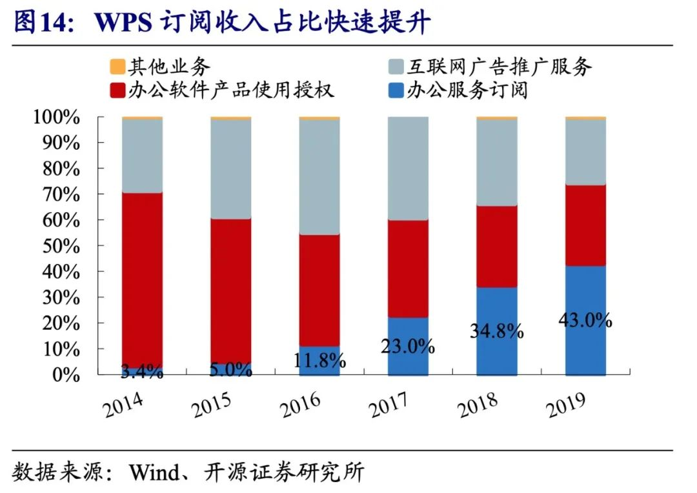

_2020年8月开始，我在位于珠海的金山办公轮岗，为期半年。金山办公的主要产品，是另一个更为人所知的名字——WPS。公司坐落在整个珠海市风景最优的地带，一条马路之隔，即是满眼蔚蓝宽阔的大海。在这里，你很容易联想到台北或是加州。城市的颜色永远青翠与湛蓝，又拥有宽阔的空间感，是很难不有好心情的地方。_<!--more-->

>"
>
>如果你想有创造性地过自己的生活，像艺术家一样，就不能常常回顾过去。不管你做过什么，以前是怎么样，你都必须心甘情愿地接受一切，并将一切抛诸脑后。
> 
——史蒂夫·乔布斯

## 1 | WPS：过而立之年，老树开新花

WPS创立于1988年，至今已有33年。而我发现，我身边的很多人可能都和我入职前一样，即使WPS已经存在33年之久了，对它还是知之甚少，或者停留在传统、古板、迂腐的国产软件的印象上。

高中时期，我曾使用过一台联想的笔记本电脑，彼时使用的office 套件即是WPS。但当时我对互联网公司一无所知，甚至没有意识我所使用的Word是微软的，还是WPS的。只是隐约地感觉到有好多ppt模板可以免费使用。

后来开始读大学，由于学校与微软有正版软件的合作，因此长期都一直在使用Microsoft Office。直到6年后，我决定去金山，我才开始密集地使用这款产品。

而此时，WPS早已改头换面。最直接的，从名字的意涵上来看，WPS所对应的Writer，Presentation、Spreadsheets，如今对应着的是**Workspace、Platform、Service**。

 

 
从组件类型上看，除了广为人知的Office三件套，Word、Powerpoint、Excel，WPS目前还有PDF、脑图、流程图、图片设计、会议、代办、日历等等，从所承载的服务上看，从文件的编辑、阅读、云存储，到分享、协作，是办公场景下全流程的服务提供。

自从使用WPS以后，我的软件取代路径是这样的：

        文档编辑：Microsoft Word→WPS；

        文件云存储：Dropbox→WPS；

        PDF阅读与编辑：Adobe→WPS；

        脑图：Xmind→WPS；

        图片设计：Canva/PS→WPS；

        文档协作：石墨文档→WPS.......

在2020年12月1日举办的WPS「CHAO」办公大会上，公司披露，**WPS Office客户端每月的活跃设备数已经达到了4.5亿**，在中国，过去三年实现了75%的增长。2019年11月，金山办公在科创板上市，开盘市值达到654.4亿元，而如今其市值已逼近2000亿。

在商业模式上，针对B端客户，WPS采用传统软件企业服务的方式，分**数量授权、场地授权**两种方式提供软件授权服务。针对C端用户，WPS主要采取**付费服务订阅模式**，针对免费用户则采用**广告推广模式**。而近年来为了进一步保护体验，广告业务已经逐步缩减。

 

 
如果熟悉金山办公历史的人，应该知道对于WPS这样一家老牌的软件公司，在与巨头微软的竞争与博弈中艰难地求生已经实属不易，而如今它所做的又是在互联网的浪潮之上，乘风破浪、利落转型、迎头赶上。这样的转型，很容易让人联想到国外软件巨头的Adobe、Autodesk等的云转型之路。

而作为身处其中的一员，不仅仅是在我上文所说的业务方面积极转型，**如果仔细观察公司这半年来的变化，也能感受到其「现代化」的决心**。

比如，电梯内外开始每月粘贴本月的用户反馈与投诉，按照用户问题、用户原文、使用影响点的版式，把产品存在的问题罗列地一目了然。

比如，公司开始大力推行价值观。办公室的墙壁上，卫生间隔间门抬头即可看到的位置上都贴上了价值观与释义，甚至对价值观的考核也纳入了绩效的指标。

而如果大家是即刻、微博的用户的话，金山文档的官博以爱抽奖、亲和力极强著称，是有名的大V。这样账号风格的出现，也能侧面反映出其整个公司的活力与自由。

## 2 | 松弛的紧张，努力的自由

我在珠海的WPS轮岗了半年，这半年最大的感受就是，**在这里的工作与生活是一种松弛的紧张感，是拥有努力的自由的地方**。

最直接的是工作时间。我们大约是，早晨是9点半上班，12点午餐；下午是2点上班，6点晚餐；晚餐之后，自愿选择加班与否，一般大家都会回来再工作几个小时。

我自己的话，由于就住在园区内，孤家寡人，所以经常是9点多、10点多离开办公。在晚饭过后，偶尔会去参加一些体育活动，例如去健身房或者去上舞蹈课，上完八点左右再开始办公一会。

我也听说有一些互联网公司，11点上班，12点吃饭，然后就午休，很多时候都在下午2点之后才开始工作，因此会工作到11点甚至很晚才下班。

如果我们实事求是去统计有效率产出的工作时长，在WPS看似下班早，工作时间不多，但实际上仔细算算总时长，其实差不太多。而又因为工作时间的分配在上午、下午，比较紧凑和集中，中午又可以午休，所以对我来说整天的脑袋都是挺清醒的，而且效率很高。如果白天的工作没有做完，晚上有足够余裕的时间可以自己主动地填补下，沉淀与积累一下。

在紧张有序地工作之余，我也花费了不少精力和时间来广泛学习、积累外部的各种知识、各行各业的动态，拓宽自己的视野。

工作半年后，这样的体会尤为深切。作为一个底层的打工人，在入职的前期学习成长的曲线式最陡峭的，**而后在岗位的知识、技能日益熟悉后，就越来越多的依靠工作积累经验，依靠经验驱动工作了，此时成长的速度就会放缓，陷入日复一日地重复劳动中**。

.jpeg)

而实际上，我们所做的分内的工作，只是公司业务的一小小小小块，而放眼到整个公司、行业、相关行业、甚至时代与世界发展的视角上，我们只是在不确定的环境中做着看似确定的事情，但**确定不一定正确、正确不一定持续**。

.jpeg)

如果想要真的在公司业务的运行过程中，想推动业务的发展、转向、甚至变革，与时俱进，同时想要更好地发挥个人的才干，增长个人的能力，避免成为平台的螺丝钉，成为脱离平台后依然有真材实料做事儿的能力的话，**势必是需要一个更具前瞻性、洞见性、丰富性的视野，一个更具迁移性的个人能力模型，一个良好的面对生活与未来的心态**。因此对于外部知识、技能、经验的学习与积累也非常重要。

.jpeg)

在珠海WPS的半年，我觉得它是一个相对安静、单纯、拥有自由与空间的时期。整体的工作时间与工作节奏都不算特别特别急促，整个自然环境与人文环境都算松弛，没有外在环境强烈地限制你一定要努力加班。**在这样一个环境中，你是可以拥有努力的自由的，只要有主动性，是可以在松弛的外在环境下，紧张有序地提升自己的**。

从我自己来看，我在珠海变成了一个我自己都难以想象的「自律」且生活丰富的人。工作上，每日用Notion精确地管理项目与待办、认真工作、坚持写工作周记；个人生活上，下半年读书大概15本，健身房打卡将近30次，上爵士舞蹈课22次，开始写微信公众号，每周社交认识新朋友至少一次，周末探索珠海周边的城市顺德、佛山、深圳、阳江等，感受广府文化.....

## 3 | 走出象牙塔，拥抱真实世界

关于我为什么选择形单影只地离开北京，前往珠海的WPS轮岗，其实当时的原因主要有三点：

1. 我之前暑期在Lark海外产品战略实习，对于协作办公软件已经有一定的积累与了解，也很感兴趣，在工作的具体业务上具有一定的延续性；

2. 在北京的互联网公司工作是常规选择，也是可以回退的后路。而去珠海的互联网公司绝对是新体验、新机会。当时我心里想：在北京的互联网公司不稀奇，在珠海的互联网为公司才稀奇；

3. 有敬重的北大师兄也在珠海的WPS，也因此对即将接触到的工作内容、工作团队的信息了解较多，感觉是非常好的机会。

这半年在珠海轮岗的经历，对我来说收获颇丰，特别是在珠海遇到的很多同事与朋友，和我之前身边的朋友、同学都挺不一样的。

和好多同事都曾经深刻地聊过天，和大家聊起各自的成长经历，其实很多不是典型意义上好学生的样本，但是，你又可以在身边的许多同事身上发现各种各样的闪光点。

而且，大家在工作场合专业、认真与独立的行事风格，由经验、敬业带来的工作表现上的稳定性与责任感，以及乐于分享的大度与热情，是真的会让一个小菜鸟感受到深刻的认同感与归属感的。

这也进一步让我确信，**工作的逻辑和学习的逻辑真的是不太一样**。学习时，有绩点的目标，有明确的学习内容，有相对有效地学习方法，有及时反馈的一套做题机制，有明确的绩点奖励。

而到了工作的场域，虽然有KPI的目标，但除此之外，要解决的一切都是开放式问题，什么策略是好的，如何推动团队把事情落地，如何衡量活动的效果，如何让老板对自己的表现满意，一切都没有什么唯一正确的答案，也没有明确的学习方法，更没有特别及时的反馈。很多时候，甚至是经验在推动着业务真正的决策。不过或许这就是真实世界运行的规则。

说起来有点羞愧，一开始工作的时候，我还总是想着证明自己，对自己要求特别严格，也特别容易对自己失望。后来我发现，这种心态会很限制自己，活得很累，还容易产生反效果。

我很快就意识到了在工作的场域，我很多地方确实是小白，没有岗位需要的知识储备、没有SQL、Json的技能、没有做商业化运营的经验，我就是应该抱着虚心学习的心态，鼓励自己的进步，不断积累经验，而不是苛责自己。

另一点，让我颇有收获的是，在珠海接触到的不同的人，让我真切地看到了人生道路与价值观的多样性。**在一个高度内卷的环境下成长，很容易进入视觉的盲区，抬高某一些选择，贬低某一些选择，事实上这种价值判断的形成过程本身就是经不起推敲的**。

此外，在珠海的时候，感觉大家“人均美食家”，对于食物非常讲究，每个人都能对不同的食物形成自己非常强烈的意见与看法。所以我跟着同事们一起出去吃东西，对于我这样一个从北方过去的味觉盲人来说，在吃上得到了非常极致地享受。

最后的最后，衷心祝愿WPS越来越好，衷心希望好产品能够持续获得认可。
