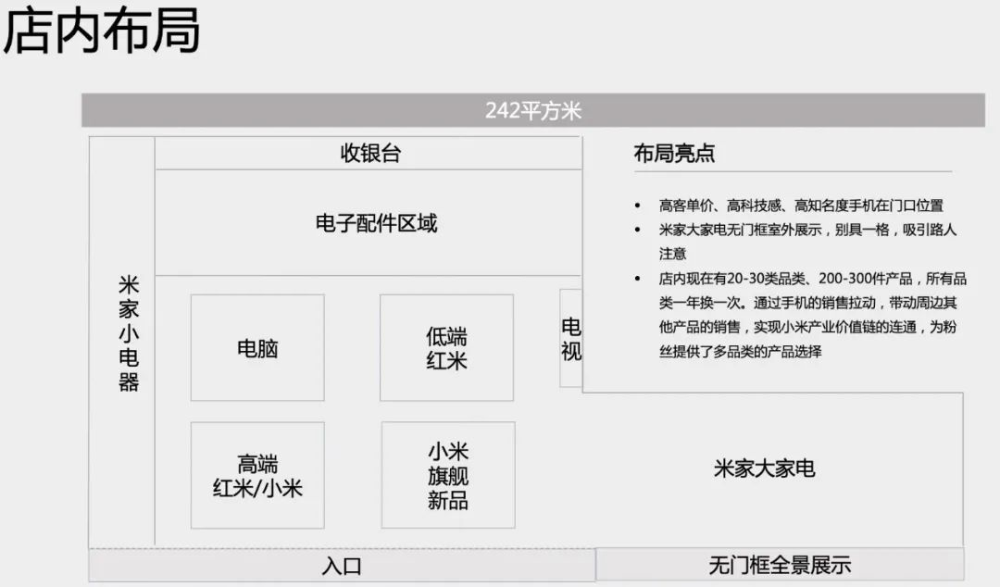
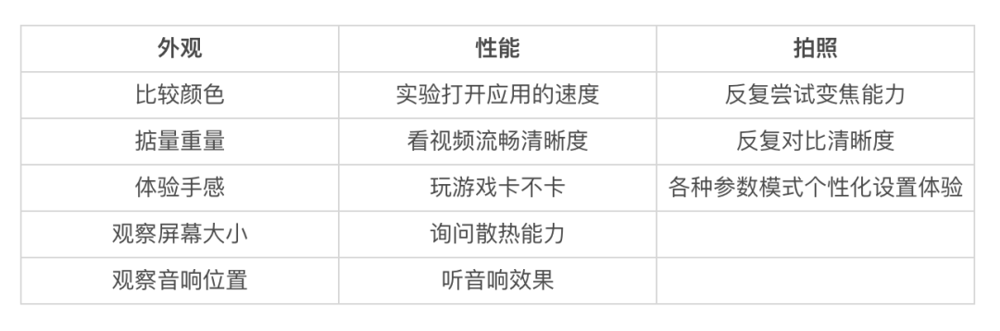

_3月29日，小米举办了春季新品发布会，一口气发布了15款新品，包括折叠屏手机Mix Fold、安卓之光小米11 Ultra、安卓机皇小米11 Pro等，官宣了造车的大新闻，还展示了200万的新logo，一时风头无两。也是赶巧，发布会后的清明节假期，我们管培的同学开启了小米站店体验活动。我和另外两位小伙伴去了昌平永旺商场的小米之家站店。每天实打实地在店里站满八个小时，永不停歇地和顾客打交道，为了达到更高的业绩努力营业。这经历还蛮特别的，因此想与大家分享一些有趣的事儿。_<!--more-->

> “
>  
> 伟大公司总是诞生于伟大的时代，全新的物种总是与全新的时代同频共振。
> 
——雷军·上市公开信

## 1 | 小米之家怎么「摆盘」

永旺梦乐商场就位于地铁昌平线生命科学院站附近，步行只需300米左右，周围居民区较多，位置不错，因此整个商场的人流量还挺大。

我所在的小米之家占地大约242平方米，位于商城一层的门口边，毗邻华为、荣耀和苹果专卖店。

**众所周知，零售店的商品摆放位置是很讲究的**。我简单给店画了张平面图（如下图）。小米新上的旗舰新品、高端红米手机，还有一部分价格稍低的小米手机在整个店的门面位置。比如小米的折叠屏手机Mix Fold就放在离入口最近的黄金位置，很多消费者即使不买，都会进来看个热闹。

 

永旺小米之家平面图

 

往后走是电脑和红米的低端线，再往后是电子配件区域，最后是收银台。店铺的左侧陈列着米家的小电器，右侧的墙壁上展示着小米电视。

店面的右半部分是米家大家电的陈列区域，采用了**没有门框的全景展示方法**，对那些对电子产品不感兴趣的顾客来说，他们走进小米店也能看到这些较为刚需的大家电品类产品。

## 2 | 他们站在手机桌前那么久，究竟在看什么啊？

我的电子产品绝大部分都是线上渠道购买的，而且之前是完全对手机各种参数无概念的人，且购买决策大多依靠朋友推荐影响。

因此，多年来，我一直有个迷思，**为什么小米、苹果店里的手机、电脑展示桌子旁边总有那么多聚精会神体验手机的人，他们究竟在看什么？**

我也曾多次尝试站在桌子旁煞有介事地体验产品，但是基本上感受下手感、看看相机、打开几个常用的APP随便看看就结束了，用时无需超过五分，且我的内心是没有判断的，因为我根本不知道应该看什么指标。

这次站店的第一天，我就仔细观察了一些来店里的顾客，他们究竟体验手机都关注些什么？

众多耳熟能详的参数代表是芯片的型号，屏幕刷新率，相机的像素，这些在产品上市时是会被反复突出的性能优势。我们在站店之前的培训活动中，学习了大量有关参数的知识。但是在具体的站店过程中，其实消费者问这些参数问题都比较少，**毕竟再厉害的参数也是抽象的，实实在在的产品上手体验才是真正具体而重要的**。

**其实线下的很多用户手机的体验和挑选都是非常细致的，而且每个用户在意的点都非常具有主观性**。比如有些用户极其在意颜色的挑选，有些用户就想买屏幕小些的手机，有些用户就想买相机好的手机......如果总结来说的话，分为外观、性能、拍照能力这几个部分，具体如下表：

## 3 | 线下零售原来占比这么高！

当带着我的消费习惯和认知来到线下门店，我才发现，线下实体零售体量比我想的大多了！根据中金公司的研报显示，目前线下销售仍然是国内主流品牌机型的销售渠道，如下图，基本除了小米以外，**所有手机厂商70%以上的收入都来自于线下渠道**。

.jpeg)

2015年，小米曾是国内出货量第一的手机。但是到了2016年，严重下滑到了第五，仅占有8.9%市场份额。这背后，是OPPO和vivo均依靠线下渠道取得的飞跃式增长。

此时雷军感到了压力。小米拥有互联网基因，靠电商起家，但雷军也不得不承认这也是小米的弱势。2017年2月，他在接受采访时透露，“一个不争的事实是，（小米）就算在电商手机市场里占50%的份额，在整个市场也只占4%，今天传统零售和传统渠道依然是80%的市场。”

在当时的亚布力论坛上，雷军说，**“我认为小米的商业模式不应该是电商，应该是新零售。”**他表示，小米将用3年时间开1000家线下体验店。

于是在接下来的几年里，小米疯狂开店，不断地拓宽线下零售份额。

.jpeg)

.jpeg)

实际上，更反直觉的是，网上购物目前在中国已经是个如此耳熟能详的行为了。**实际上，直到2020年，也只不是占据了社会消费品零售总额的24.9%**。线下零售行为依然牢牢地把持着统治地位。

.jpeg)

2014-2019年，全国线上零售额从27898亿元增长至106324亿元，线上零售总额虽然持续增长，但是不可否认的是近年来线上高增长时代已过天花板，2014-2019年线上零售增速总体下滑，增速放缓。**线上流量见顶。**

.jpeg)

## 4 | 关于C端销售的一些思考

我们这次去小米站店，都是背负着挺大的销售业绩，所以对销售结果还挺看重。但要注意地是，小米之家并不是非常销售导向的，还是以服务为主。因为一味地销售导向，也会造成问题，毕竟口碑的形成依靠的是更普遍的消费者认知。实际上，服务好一些未来的潜在客户，也是有利于品牌的建设和未来收入的增加的。以下只代表我们个人的一些规律总结：

**(1) 如何提高个人的成交的概率**

 一般来说，我们可以把进来小米之家的客户分成三类：

- 随便逛逛--一般你是不会赚到他们的钱的；

- 已经想好买什么手机的人--这样的人碰到就是赚到；

- 想买手机，却不知买哪款的--发挥销售能力的时候到了！

第一类，是随便逛逛的客户，一般他们不会产生购买行为，他们有可能会对小家电、小配件随手买一个，但是对手机、电脑等高客单价产品不会。

第二类，是已经想好要买什么手机的用户，他们一般会在店里体验一下下，或者直接拿货结账。此时，**他随手招呼的店员就可以顺利地挂上业绩**。这样的客户在店里还是相对多见的，且有时候是第三类客户转化而来，有可能第三类客户早上已经被其他的店员进行过一番介绍引导，但是犹豫不决，又回去想了想，下午直接就来买了。

这样碰到就是赚到的客户一方面要看我们的辨别能力，另一方面更重要的是运气。我们这次活动的销售冠军任阿伟这样总结：**“销售90%靠运气，10%靠勤奋：运气你一般改变不了，但可以用勤奋（增加工作时间）来弥补。”**如果想到多碰到这样的用户，增加工作时间增加碰见的概率是个正解。

第三类客户，是想买手机，却不想买哪款的。这类客户往往会在多个机型、多个品牌间比较，且线上线下渠道比价。**这类客户是最为考验销售能力的，通常花费的时间也比较多，但是成单之后给销售人员带来的成就感也是最强的。**此时，一些有效地方法包括主推匹配其需求的产品、阐明性能优势、缺货预警、线下礼盒诱惑等等。

**(2) 如何提高销售的效率**

其实就是，有效地定位与第二类、第三类客户，劝服第三类客户，筛除第一类客户。

销冠阿伟老师的经验是：

「首先，通过不断的观察，总结你的目标客户画像，在众多顾客中找到更容易成交（符合你标准）的顾客； 

其次，话术是提高销售效率的重要手段：想清楚你的目标是什么，有时候不需要很委婉，也不用觉得太唐突，自然亲和的向客户表达“请问您今天想卖一台什么价位的手机？”或“请问您是想买最新款的手机吗？”直接得到你想要的答案，即便会有一些顾客嘴上说的“就是看看”，但通过他的语气状态，其实可以判别他是否真的只是看看；只要你语气温和，微笑服务，顾客是不会有啥不好的印象的。」

**(3) 如何理解销售的价值（by 阿伟老师）**

「从销售的角度上，销售的价值不仅是匹配需求，更是创造需求；你有能力成交不可能，有能力把100块变成200块的成交，才是销售的成功。但是，从长远看，如果我们不仅是销售的身份，而是提供体验和服务的品牌价值传播者，例如，很多顾客总觉得华为更好，那我通过我顾客的交流，即便不买手机，但在他心里种下一颗小米其实更值得拥有的种子，那这是销售的伟大。

当然，除了销售本身，不要错过和有品位、感兴趣的顾客交朋友：对于举止谈吐不凡的顾客，我愿意投入1个小时和他聊更多，然后加微信好友，未来未必不会产生进一步链接。」

## 5 | 一个彩蛋

永旺店的小米之家里，还有个奇奇怪怪的人。疫情后，下图的这位大叔就几乎每日不间断地一直站在相同的位置以相同的姿势，左手永远握着他白色的帆布包，右手用着同一部手机——看小说。小米之家的工作人员们也从不打扰他。

.jpeg)

此外，店里也常会有风尘仆仆地顺丰小哥、外卖小哥来店里给用桌子上的充电线手机充电，有莫名其妙地大哥大叔每晚下班后来和店员插科打诨。

**不禁感慨，小米之【家】名字取得还挺名副其实。**