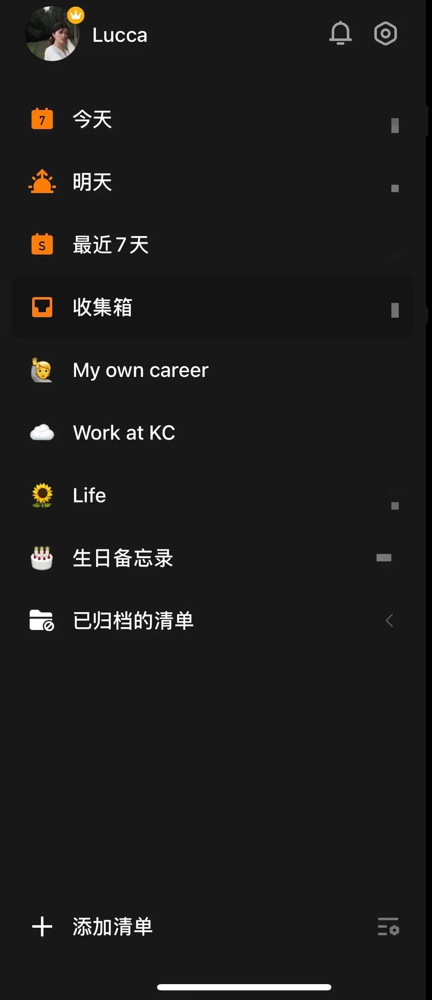
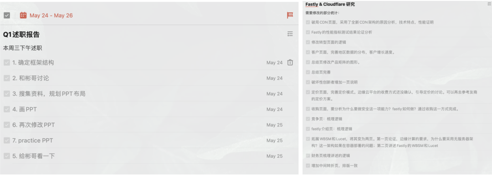

_使用滴答清单快两年了，最近重新组织了下清单结构。记录之，文章一共分为三部分：_

_1. 我是如何更改清单结构的，以及背后的想法_

_2. 我最喜欢的滴答清单功能_

_3. 清单作为行事工具的思考_ <!--more-->

> “
>  
> 毛姆写道：「任何一把剃刀都自有其哲学。」
>  
> 大约是说无论何等微不足道的举动，只要日日坚持，从中总会产生出某些类似观念的东西来。
> 
——村上春树《当我跑步时，我谈些什么》

## 1 | 删繁就简，回归需求初心

2020年初，刚用滴答清单的时候，我的想法是，通过滴答清单，我要将生活全面的管理起来。我知道用「管理」这个词颇为自大，不确定性才是生活真相。

但是这个工具就好在不管生活怎么变化多端，都可以把所有的事件通过输入、排列、行动、打勾完成这一系列动作来落实。以此，过上非常井井有条，抵抗遗忘的organized生活。

在app的结构上，滴答清单最主要的是清单功能，主要是两类。第一类是默认分类，包括收集箱、今日、接下来7天、所有、分配给我等。在app的结构上，除了自己设定的清单上，默认地分类是收集箱、今日、接下来7天、所有、分配给我等。第二类是自己设计组织的清单。

在自己设计的清单上，最开始，我的想法是，把生活分成三个主要部分：work、life、growth。work里面包括正式工作、业余事业、以及与工作有关的社交；life里面包括生活杂事、运动、与工作无关的社交、亲密关系、以及朋友们的生日；growth里包括阅读计划、写作计划、英语学习的安排等。

在记录的事情上，一般是工作中需要完成的事情，比如最近要交付一个什么工作成果；生活中需要提醒自己完成的事项，比如双十一要买啥、什么时候该约朋友吃饭等；和一些中长期的计划提醒，比如朋友们的生日（自从用了该工具，再也没有忘记过朋友们的农历/阳历生日了hhh），最近要读的书、写的文章等等。

.jpeg)

此前的清单列表

 

以这样的结构大概使用了一年多后，最近我进行了大刀阔斧的结构改革，删繁就简。

我总结来看，感觉我使用这个app的清单功能的主要场景主要是两种：一种是即时记录生活事件提醒；另一种是中长期规划生活的重要事项备忘、反复出现在视野中备忘。

目前的结构非常简单my own career, work at (my company), life，生日备忘录这四个清单。my own career是除了正式工作之外的尝试，例如读书/写作/播客/社交媒体输出等，囊括了部分此前的work和growth的部分，这些都是重要但不紧急，因此如果没有特地的push自己很容易就做不成什么成果的事情，需要单列一个清单；

目前的清单列表

 

work at（my company)当然就是和本职工作相关的清单，所有的任务和会议我都会及时记上去，可以妥善地安排工作；life这个清单就是所有生活上的事情，社交、购物、甚至是出门记得倒垃圾。生日备忘录是长期记录朋友们的生日，单列了一个清单。

清单缩减的原因，主要有两点：

1. **实际应用中，大部分清单沉睡**。我最常使用滴答清单的场景就是，我为了怕自己忘记啥事儿，赶快在收集箱里记下时间和要完成的事情，其实是不会先想事件的分类，再去记待办。这就造成了我之前设想的大部分清单都是沉睡状态。

2. **过多的分类，精确有余而灵活度不足，增加了记录的阻力**。而我在用到分类记录的功能时，一般都是在计划的场景，通常这些事情不太紧急。因此我会更有组织性地把这些事情放入对应的清单结构里。而又因为，生活的很多事情是极其具有边界模糊性的，无法进行准确的分类。如果我硬要分类，反而给自己增加了记录的摩擦力。一切还是简单、摩擦阻力最小为主要原则。

此外，对于大型的复杂性项目，或者团队合作项目，我觉得短期内以一个自定义清单的形式去完成也是不错的。可以围绕事件，来制定待办，分配给不同的人来完成，特别是此前还推出了看板功能，感觉做团队大型任务拆解和分配会很不错。但是，我目前还是个人用户使用为主。

## 2 | 最喜欢的产品功能

### 清单功能

我最喜欢的清单功能，一是强大的AI输入功能，不管是以键盘输入，还是语音输入，都可以自动识别时间、日期等关键信息，自动形成待办事项，这点比之前我用谷歌日历/苹果自带日历的日程安排方式，要输入事项、再选时间等繁琐的流程实在是简单和智能太多。

第二是围绕事件的强大的笔记备注的功能。不管之前用日历还是手写to do的方式，一般如果我想要对这个事情写一些备注、写提纲、或是事后记录等方式，都基本上要开用其他工具实现，例如备忘录，word，印象笔记之类的。但是在滴答清单里，可以围绕这个事件，做另外的笔记，甚至是做另外的to do列表。

之前使用清单记录工作流的🌰

 

### 打卡记录功能

除了主体的清单功能，滴答清单其实还有不少其他的功能，比如番茄时钟、日历功能、习惯记录功能。我自己最感到实用的功能是习惯记录功能。

我主要是用这个功能来track自己的锻炼计划。它可以设定每天的提醒时间，然后每次锻炼完，就去打卡记录，还可以做点锻炼小笔记。它的呈现形式是以日历加上记录的形式，长期坚持下来，就可以看到自己整体的运动频次和一些当时的心情，还是蛮有意思也很有成就感的。

.png)

运动最多的8月份的锻炼习惯track列表

 

### 3 | 对于清单形式的思考

之于滴答清单这一个app，我感觉在现阶段，它的英文名「Tick Tick」或许更符合其在我生活的效用——Tick Tick，记得打钩这件事哦~

有时候，我在想，如果我是滴答清单的PR人员，或许我不会单单强调其时间管理的功能，同时也会强调以清单形式组织生活的哲学性。

事实上，清单这一形式蕴含的管理哲学思想其实远超于提醒，之前读过《清单时代》，对其中对于清单这一形式的效用，其描述地更具深度：

**「清单可以看做是一种强制函数的方法：即用相对简单而直接的方法来迫使必要行为的发生，如使用清单来塑造行为。」**

书中提到Brenda Zimmerman & Sholom Glouberman是两位专门研究复杂性科学的教授，他们把世界上的问题分为三类：简单问题、复杂问题和极端复杂的问题：

1. 简单问题：具有明确解决方法的问题。例如用特定的配料烘焙蛋糕，对于这类问题，可能需要学习一些基本技巧，但是一旦掌握了这些技能，成功的可能性就变得非常大；

2. 复杂问题：类似于把火箭发射到月球上这类问题。虽然有时候可以将其分解为一系列简单问题，但是却无法找到直接的解决方案。一般来说，这类问题需要掌握不同专业技能的人组成团队，通力合作才能成功解决。时机和协调成了成功的关键因素。

3. 极端复杂的问题类似于抚养子女这类问题。因为每个子女都是独一无二的，因此成功抚养一个孩子的经验并不意味着在抚养下一个孩子的时候也能成功。专业技术非常重要，但不是获得成功的充分条件，结果的不确定性非常大。

简单问题简单处理，几个提醒足够。而生活中往往对我们的生活会产生重大影响的事件，通常是复杂问题、或是极端复杂的问题。

面对此类问题，解法复杂，结果也通常不可控。碰上这些问题的时候，通常也是比较迷糊，比如工作中的大型项目交付、或是做好一个需要深度研究的报告，生活中比如如何维持好亲密关系、如何找到喜欢的工作等等。

我觉得用制作清单的方式，将必要的行动步骤系统化地写下来，脑子清清楚楚地掌控生活，是非常有效地方式。

因此，在具体的滴答清单的应用中，我非常喜爱笔记的方式围绕事件规划行动。如果在团队协作的过程中，以清单的方式规划好各方的动作，需要遵守的原则，交付的时间节点，我觉得也会是很好的管理形式。