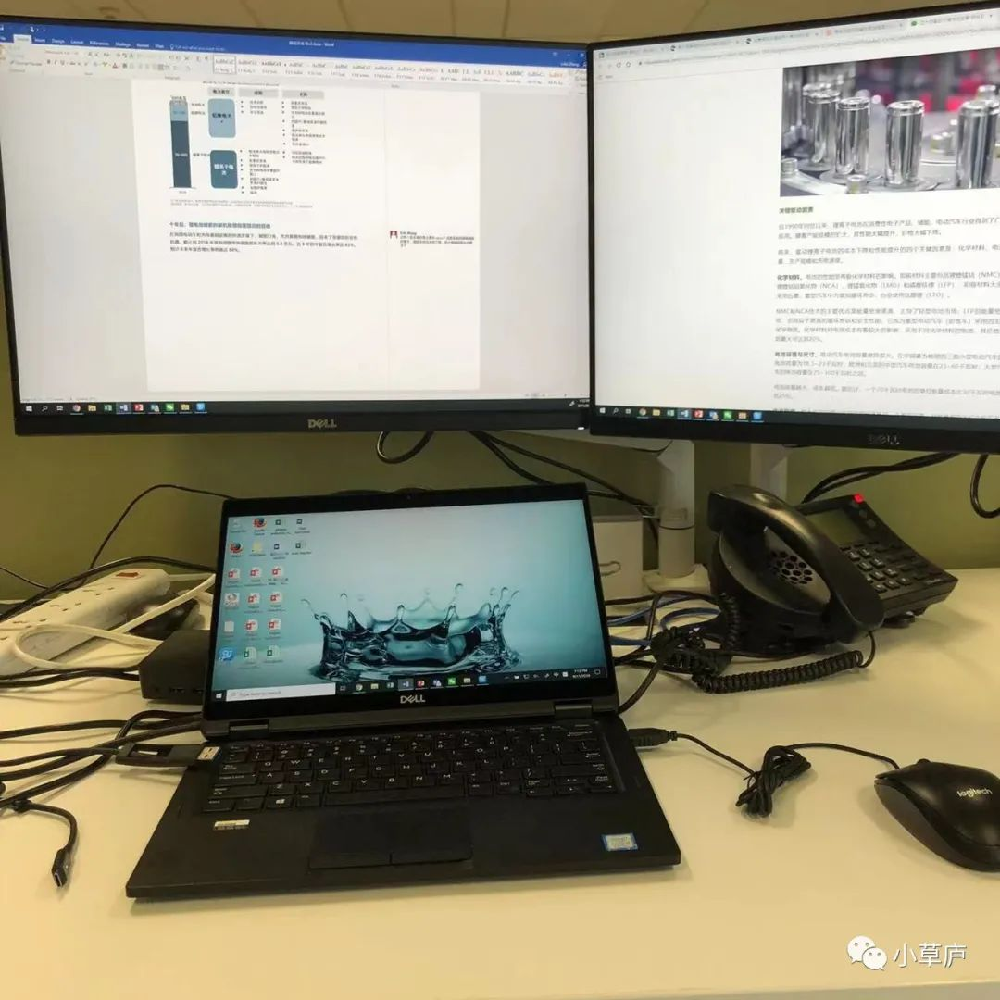

_18岁，作为高考制度下的佼佼者，张展顺利进入北大。22岁，张展从北大新闻与传播学院本科毕业，进入一家国际领先的咨询公司工作，base在上海最繁华的静安区南京西路。_

_他在公司附近租了一个loft，每日穿梭于繁华的高楼大厦间工作与生活，开始他期待已久的咨询职业生涯——准备秋招的那个暑假，他练习了近130个case；此前，他也辛勤做过咨询公司的实习工作。_

_而两年后，24岁的张展从咨询公司辞职，回到北京，成为记者。他陆陆续续发表了不少文章，写在拼多多上买书的年轻人、写在海南依靠椰子为生的农民与企业家、写Prada菜市场爆火后，菜市场在市民生活中的繁荣与衰落......_

_这篇文章的主人公张展是我高中的学弟，我们认识近十年。我敬佩张展的勇敢，也由衷为他的年轻的人生故事着迷——个体经历上足够特别，社会意义上又足够有普遍性。_<!--more-->

> “
>  
> 起床，有轨电车，办公或打工四小时，吃饭，有轨电车，又是四小时工作，吃饭，睡觉；星期一、星期二、星期三、星期四、星期五、星期六，同一个节奏，循此下去，大部分时间轻便易过。
>  
> 不过有一天，“为什么”的疑问油然而生，于是一切就在这种略带惊讶的百无聊赖中开始了。厌倦处在机械生活的末端，但又是开启意识活动的序幕：唤醒意识，触发未来。
> 
> 未来，要么在循环中无意识的返回，要么彻底清醒。觉醒之后，久而久之，所得的结果，要么自杀，要么康复。百无聊赖本身带有某种令人反感的东西。不过这里，应当得出结论说，百无聊赖也有好处。因为一切从觉悟开始，惟有通过觉悟才有价值。
> 
——加缪《西西弗神话·荒诞藩篱》

## 1 | 什么是好的工作？

进入大学后，**一些“存在主义危机”爆发的时刻是剧烈而无助的**，比如尝试着询问自己“喜欢什么？”“以后要做什么？”“要成为什么样的人？”。

真实世界的广阔画卷在你的面前徐徐展开，你被寄予丰厚的社会期望，但是你好像不太清楚，你想要什么。

对于张展来说，这个时刻是大二的寒假。

当时张展因缘际会认识了不少优秀的学长学姐，毕业后的他们拥有着Great Expectations(远大前程)，有的在美国谷歌做Data Scientist，有的在VC做投资人，工作有趣而体面，也有自己生活、额外自我学习的时间。这样的生活状态让他觉得向往。

如果说此前张展对于职业的认知还懵懵懂懂地处于「可能我在新闻传播领域，那我以后应该就会去做传媒相关工作」。

那在这个寒假里，他对于职业的可能性的视角则被大大拓宽，他在想的是「是不是真的有这样的工作，工作内容我比较喜欢，同时也可以获得很好的经济回报？」

如果按照原来的职业发展视角来看，其实也可以很可以理解，投身于传媒行业通常在名校毕业生的鄙视链条中，处于比较低位的选择，进入的门槛没有那么高，经济回报低，社会地位和认可度没有那么高。（注：仅仅从普通毕业生视角出发，无对这一行业的负面评价之意，实际上这一行业的复杂度、可拓展性是极高的。）

和很多被“职业规划”这个词敲打的名校同学们一样，张展开始认真地思考自己未来的选择。

这个选择的方向朝着**「要成为一个看起来『绝对成功』的毕业生」展开**。如果围绕着这样一个择业目标，这些职业带来的预期是：

1. 精英，门槛高，对人才的筛选程度极大，进入即意味着我是个优秀的人；

2. 经济回报足够高。一路成长于标准明确的环境，毕业后再用什么标准确认个人的优秀与成功呢？无非是金钱、权力、社会地位。而刚毕业的我们，最简单、直接、可衡量的就是金钱；

3. 存在着良好的工作预期，给我们一种进入非常fancy的工作环境的期待和幻想。

在明确这样的职业预期后，职业的可选项其实也很明确了，无非是咨询、投行、VC、PE、战略、顶尖互联网公司、红圈所/外所的律师这样的工作。如果再加上专业的限制条件，张展觉得咨询是个最适合他的职业选项。

## 2 | 「练习case给了我喜欢咨询行业的错觉」

对于很多优秀的同学是这样的，**一旦目标明确且意愿强烈，执行便不再是问题**。

大三上学期，张展找了一份埃森哲战略的实习，初步了解了咨询行业所会涉及到的工作内容。

但张展心里对于学生时代花费太多时间在实习上是排斥的，「很多时候实习都是在做一些打杂、没有提升的事情，只是为了刷简历。**以后的人生里有那么多时间都在工作，没必要把现在宝贵的学校的时间花在实习上**」。

大三下学期，张展便停止实习工作，边在北大自由的选课、上课，边着手开始考虑准备咨询的面试。

咨询行业招应届毕业生是有一套比较明确的标准和流程的。首先是本科的学校和学习成绩，这会决定简历关的通过与否，很多比较TOP的咨询公司基本只有几所Target School。

接下来，通过简历关以后，会有四到五轮的面试，面试的基本形式是Case Interview。典型的Case Interview问题会包括市场规模的测算，公司的盈利能力分析，公司是否要进入一个新市场等来源于真实商业世界的问题。

对于张展来说，学校和成绩都是前3%的水平，对那些看重学业表现的公司来说，通过简历关不是问题。他当时的短板主要在实习经历的欠缺，所以他给自己制定的求职的策略是：

「因为实习确实比不过别人，所以如果要成功的话，那么就必须保证在通过简历关后面试的通过率。」而**保证面试通过率的方式，就是保证自己在Case Interview中的表现**。

咨询行业的Case Interview久负盛名。通过考察候选人解决case问题的思路，可以非常清晰地看出候选人在思考问题上的能力，即是不是能用一种比较结构化、富有逻辑性的方式解决问题；同时，case的全程都需要面试者与面试官表达交流沟通，它能检测面试者能否将一个事情讲清楚，能否用表达说服别人，让别人觉得很有道理。

当然，也有非常残忍地揭示，即直接简单地感受到面试者**商业sense是否敏锐，以及是不是够聪明**——理解问题是否迅速，给到一些提示，是不是能很快get到。

当然，**有较为标准化的考核机制，就有较为明确的努力方向**。

在大三的暑假，张展找到了几个非常优秀的case partner，密集地去做case的训练。

他当时练习case的节奏非常紧凑，每天从早上十点到晚上十点。一般一个模拟case interview需要两个小时，和case partner轮流给彼此做，并且互相复盘，一般上午能做一轮，下午能做一到两轮，晚上可以做一到两轮。

张展在两个多月的时间里，练习了130个左右的case。对他来说，做咨询的case练习其实是一件很快乐的事情，**是一种框架型思维能力的提升和个人肉眼可见的进步的感觉**：

「首先，做case其实是一个练习的过程，每次做完一个后去总结，会有很多收获；然后，每个case的所提出的问题和指向的行业也非常不一样，很丰富很多样；第三是，和小伙伴们一起做咨询case是个相互沟通、交流、进步的过程，我可以感觉到我的case partners都很喜欢和我一起做case。

**这种纯粹的思维上的东西很好玩**，和我工作以后发现一个月都在做重复的一个事情的感觉非常不一样。

所以我现在回想那段时间，**练习Case的过程好像给我产生了一种错觉——我好像很喜欢这种工作，然后适应地很好**。」

后来，在秋招时，和以前所有的标准化考试一样，张展依然是那个快速而又准确的实现目标的人。

## 3 | 「被规训的、被反抗的」

2019年8月，上海的南京西路，依然是炎热、繁华而精巧的，林立的高楼大厦冷峻而神秘。离开燕园的张展踏入高楼，正式开始咨询的工作。

 
.jpeg)

静安南京西路窗景

 

张展最初给自己设立的目标是，要做Top Performer，要快速升职，将来要成为这个体系里最高等级的Partner。**「我有一种非常习惯性的东西，就是在任何地方都没有办法接受中游的水平。」**

入职的前两个月，处于行业新人蜜月期，张展快速吸收着周遭环境的新兴的一切，由于种种原因，张展在这两个月没有被分配到项目，而是在准备一些投标方案。

11月，张展开始正式进入第一个项目组，和预想的完全不同的工作方式和身心状态突然砸向张展，已经接近两年没有再做过实习的他，无法快速习惯这种被指定工作内容的工作模式与快节奏的交付要求。

张展就租住在公司附近的一个loft里，五分钟即可步行至公司，每天早晨9点30开始工作，晚上平均在12点下班。

他工作的主要目标是给客户提供商业战略的解决方案。一个解决方案是由一整套逻辑严密的观点与论据组合而成的。

张展需要围绕所需证明的观点，通过专家访谈、案头研究、数据处理等多样的方式论证，最后围绕这一整套逻辑所形成的产出就是一个极其美观的PPT。同时，在提供方案的同时，他也需要实时地去回应客户的要求，做任何客户需要的信息搜集汇整。

 

日常工位

 

**如果不去反思工作的意义和价值，只管做一个具有职业精神的工作者，全身心地投入自己选择的职业里，沿着规则向前走，一切便都是自然、且具有不言自明的某种应然，那也是不会痛苦的。**

**但一旦想要在工作中寻找到更多的自我认可的意义，自我存在与价值的肯定，那么事情就会变得复杂。**

咨询行业虽然是门槛高的精英聚集的行业，但是归根到底，它是个服务行业，它用最为聪明、有逻辑性、有商业才能的大脑为企业服务，因此咨询行业工作主要是围绕着客户的需求在行事。

张展最大的困扰有两个，一个是在反复、琐碎的日常工作中感受不到自我的价值与意义，另一个是忙碌的工作完全剥夺了个人自由的生长与探索。

和练习解答咨询case中获得的思维提升与理解快感不同，咨询的工作是**「客户有着明确的要求，公司里有人管理着你、你有预期的交付时间，且最后做出来的东西也不属于你」**，你只是商业PPT生产里的一环，很难从其中获得一种明确的获得感，和强烈的认同感，你的时间、注意力和权利被剥夺，以换取不菲的薪酬。

而高强度的工作也完全剥夺了个人探索生活丰富面向的可能。早在北大读书时，张展就意识到自己是一个**「对时间的掌控性，和对自己生活的掌控性要求非常高」**的人。

在大学里，张展会有强烈的主导意识去分配自己的时间。每学期的开始，他都会看全校的课程表，挑选自己在修习的学分之外，感兴趣的、想去听的课程，社会学、法学、文学等多有涉猎。

而在学校的每天时间，他也会把自己的时间和想做的事情做非常详尽的计划。「我很怀念大学的时候，那种**自由探索的状态**，不管是上课也好，还是写论文也好，我都能根据自己的兴趣，学自己想学的东西，研究自己感兴趣的话题。」

 
.jpeg)

在北大做作业汇报

 

**这样一个在智识上有自己的强烈的主张的、自由、独立、而完整的人格，在被社会的、职场的规则规训时，是无比痛苦的**，「当这种自由探索的状态被工作替代了，你没办法掌控自己的生活了，是非常非常不开心的。」

张展从内心生出的本能的对工作的排斥——「不想做，觉得没有价值」。

「这份工作，它是你在为别人去做一个东西，是一个非常复杂的交换。你用你的时间、精力来为别人工作，换来的是一种非常偏执的渴望——你想做一个精英人物，你要做一个大家都觉得非常非常卓越的人。

但你每时每刻都会觉得这个东西你做了是没有任何成就感的，你不知道这个东西做了有什么价值，为什么你要做这个东西。**这种交换的根基是非常脆弱和单薄的，它只是一种你想象中的信念而已。但又显得那么坚实，因为你确实在这个现实中运行着这一套想象的逻辑。**」

这种相互矛盾与挣扎的状态，让张展非常痛苦，「以至于后来每天、每时每刻我都要给自己做心理建设，我才能继续工作下去。」

而与对工作不开心并存的还有对自我的高要求，张展坦言，**「其实到后来我已经没有刚入职的时候那样的目标了，但我还是没有办法接受给出一个非常差的东西，不想成为不负责任的团队成员，也不想让别人失望」**。

甚至在后来组内的review结果出来的时候，张展被一致认为是组里motivation最强的人，「我那时听到的时候也觉得很诧异，我每天都不想工作，但我得到的评价确实我的motivation是最好的。」

当然，在众多琐碎无聊的时间里，也有少数让张展觉得有成就感的事情。

PPT作为咨询公司的主要交付物，承担着信息传递的重要功能。能不能把一张PPT做好，同时检验着咨询顾问的信息整理与提炼能力，以及表达能力。有的时候面对复杂的信息，如何用最清晰的可视化方式去展现，是一个非常困难的问题。

**张展在公司里是以PPT画得好著称的。**

「我可以用视觉设计和文字表达，把一页PPT里原本冗杂无序的信息传达地非常准确，我觉得这是非常体现我的个人创造力的，也是我感觉到我能区别于其他人的地方。」

而这样的能力，或许与张展对于商业的分析能力并无过多相关性，而与他在学生时期的新闻传播素养与训练关联更大。

而且张展做事极为认真、靠谱和细致。有一次，张展负责处理一个非常复杂的百万量级的数据分析工作，一旦有一丁点数据上的错误影响就会非常大，张展能够非常准确、快速地交付分析的成果。

他的leader对他说：“处理这些数据确实很复杂，但是我不需要检查你的成果就知道你会做好，因为我非常信任你的能力和态度。”这种坚实的肯定也确实给张展带来了明确的自我认可。

## 4 | 放弃与重建

2021年7月，张展独自去了西安旅行。**「我记得，在这趟行程里面，我在有意识地控制自己的支出，就好像已经有某种预感，要做出一些改变了。」**

那个神祇降临的时刻是这样的：

「当时我带着长焦镜头和相机在汉中的鸟类拍摄基地拍摄鸟类。我埋伏在草地里很久，一直在等待一只鸟飞起来，我想拍它飞起来的时刻。但是我等了很久，它一直没有起飞。但是我没有离开，还是站在那里等它。后来，过了很久，**这只鸟终于飞起来了，而且居然是朝向我飞过来**。我拿着摄像机，拍了好多张那只鸟的照片。

**我突然感到巨大的遗憾——我的生活里应该多一些这样的时刻。**」

 
.jpeg)

在汉中拍的鸟

 

旅行结束回到上海后，张展重新坐回办公室里工作，「回来的周一和周二，这两天我都感觉很焦虑，感觉自己不对劲。后来到了周三，**我意识到可能不是我不对劲，而是工作真的不对劲**。

**于是，我决定放弃**」。

放弃咨询行业后，要寻找一种智识上足够有挑战性，工作内容能完全由自己掌控，工作成果能成为属于自己的作品，且在个体生活上有足够多时间与空间进行自由探索的事业，张展选择了成为一名记者。

一切都进展很快，张展几天内就找到了心仪的记者的工作。过了一个周末后，张展就迅速的辞职、搬家、离开上海、回到北京，开始崭新的生活。

**当然这样的转变不是一个没有代价的、丝滑的、无痛的童话故事。**也是有一些明确的loss——比如，张展的经济收入大幅腰斩，从独居变成与陌生人合租，从几百块的每天的餐补变成朴实地自己支出食物费用，比如出差从几千一晚的酒店变成普通的连锁酒店......

但是这些对24岁的张展来说都不是最重要的，**「如果想要，我相信这些外在的物质的东西，一定是会随着你能力和经历的提升而提升的，但其实，没有这些东西也许会影响生活的质量，但并不会影响生命的质量。」**

张展觉得过去的两年像是完成了一次**剔骨**，把一些不太干净的杂质都从身上完全地剔除，像**是某种意义上的虚伪或是虚荣，一种对于优秀的狭隘的定义，还有对于「上流社会」的幻想**——昂贵的食物、豪华的酒店，fancy的工作环境，一掷千金型的消费......

「如果我没有经历过这些，可能我还会对它们有某种憧憬和幻想，但是经历过这一切后，我不再对他们有任何好奇，我也没有任何消费升级的欲望，**我明确地知道，我实际上不需要这些，这些东西不会让我更自由**」。

 
.jpeg)

在海南采访

 

**人生的每一段经历都不会浪费，也正是这些经历本身让张展成为了现在的张展。**那些在漫长的工作时间里习得的工作能力和习惯，也在记者的工作中，让张展成为足够特别的创作者——

商业的sense，对商业模式的理解，对大规模复杂信息搜集和整理的效率，表达的准确度.......这些都不是一开始即去成为记者的人可以获得的商业训练。

更重要地是，**放弃本身让张展的自我完成了重建和巩固，也给了他对自我强大的确认和自信**，「这些是我自己选择放弃的，我觉得这是非常重要的一件事情。这件事给我带来了对未来的非常大的底气，我不会心虚。」

而目前的工作状态，张展觉得「是一种非常自洽的状态。你觉得你做的事情，是一件很有价值的事情，是至少可以作为某种代表我的东西。

同时，也是一个可以拥有未来的事情——我以后可以写出更好地文章，可以更敏锐地捕捉到市场的变化，可以有更多创作上的尝试，可以和读者在更深更广的层次上建立起链接。这些东西让我觉得我不再恐惧十年后的生活。」

在写作、采访之余，张展也找回了自由探索自我的生活，他会在下班后、在周末上钢琴课、上口琴课、学现代舞，大量的阅读文学、社会学，去摄影.......他想要的是，拓展生活的面向，提升多样性，提高感受力，更多地感受到这个世界的有趣之处。

 
.jpeg)

环骑太湖

 

这正如加缪在《西西弗神话》中提出的对**人固有一死的「荒诞」结局的解法**：构建属于自我的理念，清醒地活在当下，不受任何既有观念的绑架，**因为人生唯一有意义的就是经历，不是希望活得更好，而要活得更多，要去打开自我生命的更多可能性**。

那么，这种对生活的感觉究竟是什么样的呢？

张展前几日坐飞机出差，起飞时遇到气流，机身剧烈颠簸，他想，万一飞机坠机怎么办？但是突然他感觉到平静——即使好像这个时候真的面临死亡也没有什么太值得遗憾的事情——

**他明天就要发表一篇对他来说非常重要的稿子，而他已经非常满意地完成了它。**