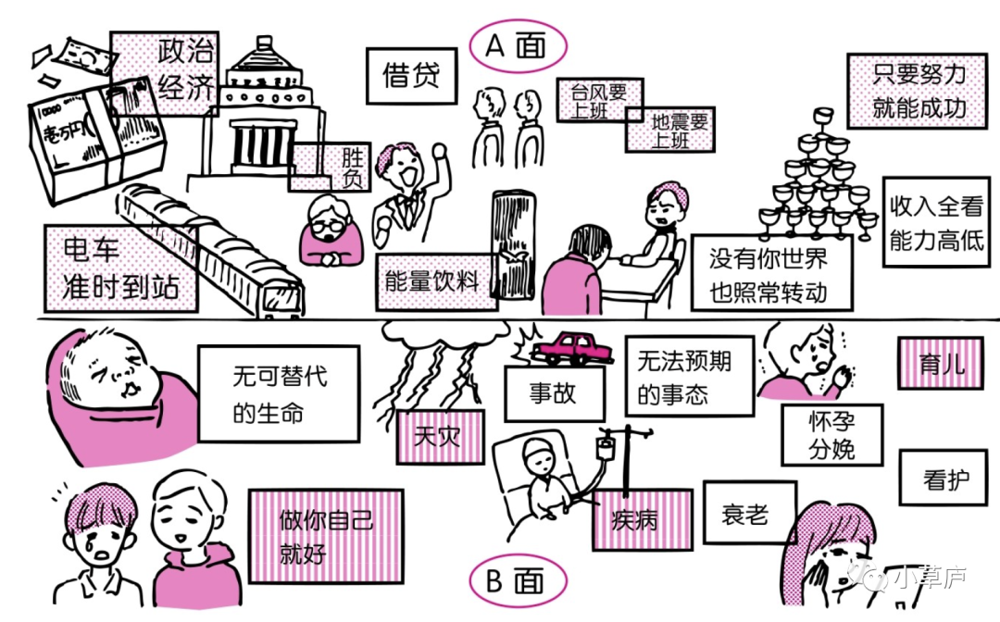
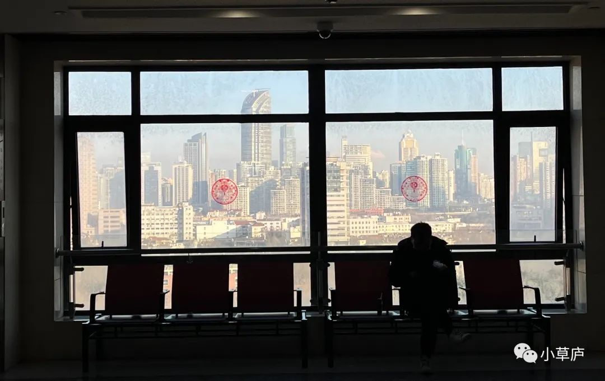

_二月突如其来的一场手术，一点感受，和读的一些书。_<!--more-->

> “
>  
> 听见你说
>  
> 朝阳起又落
> 
> 晴雨难测
> 
> 道路是脚步多
> 
——伍佰《突然的自我》

## 1 | 生活的「A」面和「B」面

前段时间读上野千鹤子《从零开始的女性主义》，对其中的一个理解框架印象很深刻——社会的「A面」和「B面」。虽然这张图在书中是用来阐释女性和男性在进入家庭后的不同位置。但是其实去性别化地讨论和使用，是可以借鉴来看待个人的生活的。

 

生活的「A」面和「B」面

 

在生活的「A面」，相信理性和逻辑，相信规则，相信努力工作、付出会有回报，关注庞大的外部世界议题，追求有意义的生活。但同时，「A面」里，也有社会丛林法则般的残酷一面，竞争、效率、价值交换等等。

在生活的「B面」，是人生里不可避免的衰老、疾病、灾难，是不可避免的未知，是无能和无奈。但同时，「B面」可能会有更多感性的情绪，会有无比亲密的支持和关系，会有自己内心的只关乎直觉的想法。

甚至在一年以前，我都很少想到「B面」的事情。最主要的原因当然是我不曾经历这些。我曾安稳地在「A面」里学习、考试、工作。

去年一年，经历了亲人的离世、朋友的重病，而就在前几日，我刚经历了一次全麻的外科手术。

虽然是个小手术，但坎坷的求医经历（在第一家医院住院四天后手术，却遭遇了在手术台上因为术前准备不够充分，手术材料缺失，而需要临时更换手术方案的大型医疗事故）、住院期间的所见所闻的「生命教育」，术前到处查资料做研究缓解恐惧，术后身体虚弱疼痛无法生活自理......

我极其突然地掉落到生活的「B面」。

我意识到，原来能够心无旁骛地在北京一个人工作、生活、健身、读书、写作、社交，不是件理所当然的事情，是还挺奢侈的一件事。看到朋友们讨论工作、关注新闻、发表观点，感到由衷地羡慕。

而且生活的「B面」本身就是来到这个世界上，我需要体验、应对的事情，只不过前二十几年的人生，我比较幸运，应对的较少。以后，这些该来的都会来的。

此外，**能够谈论工作的「价值」、人生的「理想」、生活的「意义」这些形而上的概念，也是当人在健康、自足的状态下的所谓「第一世界的追求」**。

生病的时候，这些词汇其实都离我很远，我只是想手术可千万要顺利哇，身体快些好起来，过上正常的生活。住院的时候，我甚至觉得能走出住院楼，呼吸一下楼下的新鲜空气都是那么好。

 

11层的住院楼

 

当然这也不是走向另一个极端。只是这次经历，提醒我，「A面」和「B面」都是人生必须经历的部分，都是主体性的亲身经验。

以及，**那些不管是世俗意义上或是我定义的成就感和冬天的阳光、夏夜的晚风一样，都值得我为之驻足，为之庆幸，为之衷心地喜悦**。

## 2 | 等待手术日子里读的书

从年初二确诊到现在做完手术，有很多自己的时间，也读了不少书，都是和「B」面相关的书，给了我很多安慰的书，聊以记之、分享之。

### 《当呼吸化为空气》

耶鲁大学医学博士、美国著名神经外科医生保罗在36岁，自己的事业即将到达巅峰时，被确诊为肺癌。此书的前半部分是他无比努力、成功的「A面」人生，后半部分即讲述了在确诊肺癌后「B面」人生的经历与思考。

### 《最好的告别》

哈佛医学院教授阿图·葛文德所著，关于医学的局限、人不可避免的衰老和死亡。读完对生死会有新的看法，我看完减少了很多对于死亡的恐惧。

### 《你是吃出来的：吃对少生病，病了这样吃》

前安贞医院营养科主任夏萌所著。书名即书的主要内容，「细胞修复的钥匙、人体自愈的密码不就藏在我们的一餐一饭中吗？」。写得有点碎，总结来说，就是多吃肉蛋奶、水果蔬菜，但是分析的过程和其中原因很值得一看。

### 《当下的力量》

这本很有名了，灵修类的神书。对我来说，是宗教般存在的书——每天翻几页，保持心情宁静、活在当下。

BTW，我现在身体康复中，每天都感觉比前一天好一点。祝大家都身体棒棒，周末愉快！