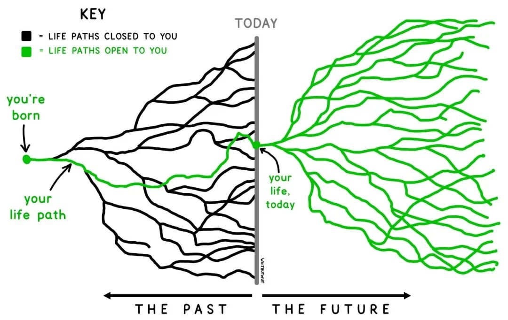
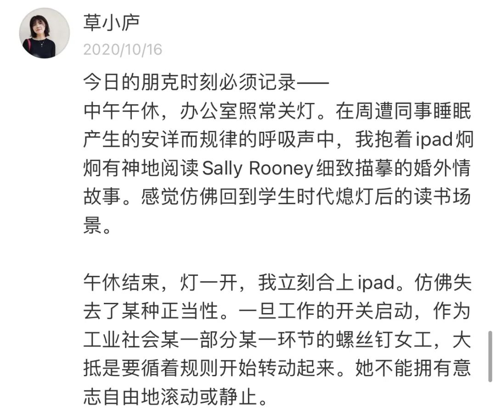
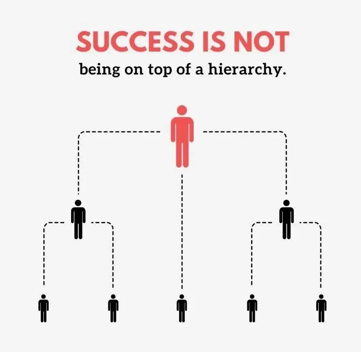
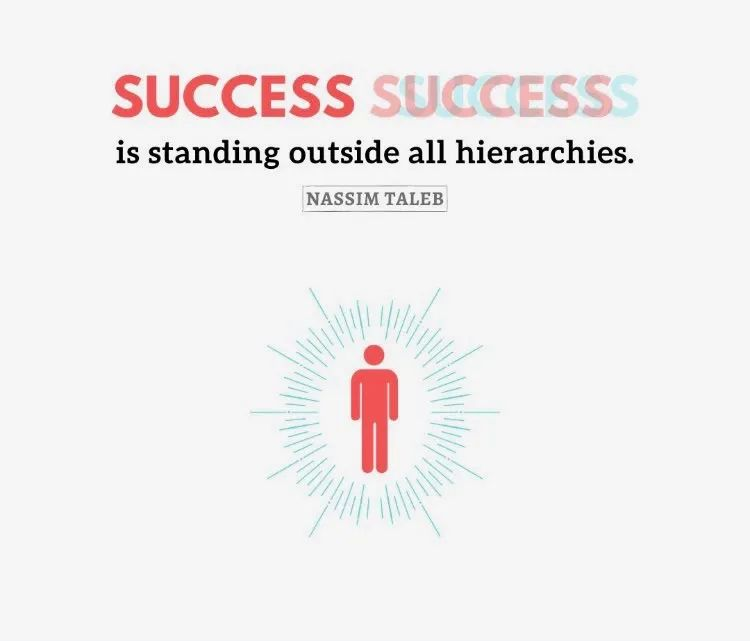
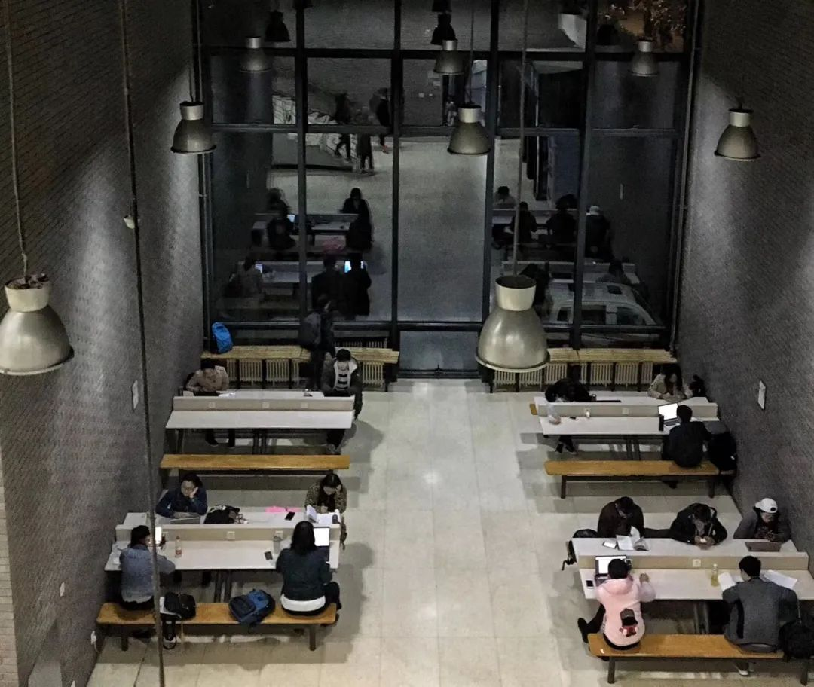

_最近盘旋在脑海里的话题是——我为什么要写作？我与「小草庐」这个微信公众号的关系是什么样的？_

_似乎目前想得还算清楚，于是写下来。_

_也想要勉励自己：人生很短，时间有限，多做点自己想做的事情吧。_<!--more-->

> “
>  
> 优秀的写作从来都是痛苦的产物。如果你没有受伤，你就没有尽力。不过这种痛苦应该是有回报的，这种回报就是痛苦完成后，从一篇成功作品中产生的深切满足感。
> 
——《华尔街日报是如何讲故事的》

## 1 | 为什么要进行个人化的写作？

我工作一年多了。工作本身还行，但是工作后的状态挺让人幻灭的——

每天上班、下班、消费、偶尔社交。以往在学校里丰富的生活图景、强烈的目标感、大量自由探索、获取新知的快乐都没有了。

看到大量的同学们为了找到一个好工作殚精竭虑，渴望上岸，看到现在媒体上大量宣传就业难，想到当年自己为了秋招/春招焦虑，如今回头看会觉得很魔幻，因为接下来的问题一点也不简单呢——

**是有工作了，然后呢？**

我的工作是互联网的产品经理，工作各方面都已经很棒了。但是我似乎没有互联网上很多古典产品经理的职业梦想——我没觉得以后一直会做产品经理的工作。我也似乎没有任何在大型组织不断升职加薪，然后成为管理者的雄心。

我只是觉得，这份工作足够锻炼我，视野够开阔，工作环境不错，同事不错，会是我成长路程上的一段很有趣的经历。

 

拥有无数可能性的我们

 

尽管如此，还是会经常感受到，自己是商业生产流水线上的无差别的一环（特别是目睹互联网的大裁员之后lol）。我有时会安慰自己，这或许才是人生的真相，生活就是这样的。

 

某天在工具理性和自我意识中穿梭

 

总归还是不甘心于此。还是想要成为不依附于外部平台的，做出自己认可的事情的人。

我究竟想做什么呢？

我暂时也不太清楚。我一直是想做**「具有创造性的、属于自我的、能有一定影响力的事情」**。

初步感觉写作/创作是这样一件事。**过记录的、自省的、主体性的生活，本身就是对庸常生活的一种反抗，是我在推石头上山的每一天并不一样的证据**。而在此过程中，若还能拥有读者，给看到的人一点点启发和帮助，就觉得非常振奋了。

做产品也是这样一件事。我觉得产品的定义非常广泛，一个APP是产品，一个公众号也是产品，一个公司也是产品。此处credit to 一鸣「Develop a company as a product」。

找到用户的需求点，通过产品的设计与实现，解决用户的问题，在此过程中摸索商业化的策略，不断地拓宽外部的影响力，实现多边的共赢，也让我觉得很有意思。

回到我个人的现状，我目前首先是想把自己的个人微信公众号做好的。我喜欢思考和创作，**且「小草庐」是完全由我创造的，完全代表了我的能力、审美、价值观，它某种意义上就是我的产品**。

 

认可的人生观点

 

## 2 | 关于个人公众号的一些观察

开始写公众号是一时兴起，但后来由于自己开始写，也逐步有意识地看了下目前个人的公众号都是怎么做的。此处我把「个人公众号」定义为：以个体身份来进行微信公众号的写作，区别于机构组织。

目前个人公众号的写作形式，我觉得可以粗粗划分为两类：**面向话题写作与面向个人写作**。

面向话题写作的公众号，常常有比较专注的写作领域和话题，具有比较强的公众性；而面向个人写作的公众号，写作领域并不严格垂直，常常与个人的经历息息相关，具有公开性的「日记本」的感觉。

两类并不严格区分，面向话题写作的也会有个人的部分，面向个人写作的也会就某个话题展开。两类公众号都有非常出色的代表。

面向话题写作，内**容本身的知识性、深度和稀缺性非常重要**，如果是持续在某个领域的写作，那么这个人一定是在该领域比较有经验的。

而面向自我写作，很容易出现的问题是，太过于个人碎碎念式的表达，实际上对读者产生不了太多价值，会太像个人日记本，除非是名人，不然很少有人会对另一个人的生活产生这么大兴趣。（如果本身公众号就是单纯为了个人的记录，不在此讨论范围。）

确实有一些面向自我写作做的不错的公众号。**这些创作者本身就要有足够鲜明的个性特点，价值观传递，让别人认同/认可/喜欢她**。虽然都是写自己细碎的生活，但是他们的文章中都可以看到清晰的价值观、自我表达，且文章本身具有极大的审美价值和趣味，而且更新频率比较高。

## 3 | 我想如何做这件事？

我最近一直在思考，自己要怎么做「小草庐」。

我一向做事都比较认真，但似乎都是出于外部性的认真——有一定的衡量标准、有别人的评价，我需要负责任。

而我对自己的这一片自留地，是完全出于对自我的要求。我希望它：

1. 有固定频率的更新；

2. 内容上，要有相对明确的定位和风格，给读者提供价值，不能成为自我过剩的表达容器；

3. 形式上，排版要有审美，要有自己的风格，要易读（i.e.一段文字不能过长、文章要有配图——要给读者喘气的时间。到现在还记得大二新闻写作课上，高钢老师强调一段话绝不能超过两百字。）

但悬在我头上的「达摩克利斯之剑」是，**创作本身就是有极高的门槛的**。它与多个因素息息相关——**丰富多样的经历/经验·敏锐的感知力·创作的欲望·创作的能力·投入创作的时间**。

我对自己写作的能力还是比较有信心的。不过，很大的现实问题是，我时间、精力和经历都很有限。

工作日每天在大厂当厂妹，整个一天都是工具理性人，下班之后少有心力。同时，也要确保足够的输入，常与他人产生联结，自己经历事情，这些都需要充分的自由时间。而内容的垂直性，要求我在某个领域能有大量的经验外溢，能持续输出——目前，确实是没有这个能力的。

「小草庐」是无法实现我的希望的。它确实会存在的问题是：更新频率太低，不够聚焦，太过自我（比如今天这篇==），所提供的价值提供波动较大。我是没有办法像很多做的好的公众号一样，有较为明确的定位，有高频的更新，总能做出有话题性、有价值输入的文章。

所以，我决定暂时放弃做一个垂类的公众号，做一个更偏向于面向自我的公众号。目前初步构想了四个范畴：

**第一类，非虚构写作**。这是我最喜欢的写作形式，用文字讲述故事，感受生活与人性的复杂，传达某一种观点，表现时代的某一种面向。

《与想象中的精英告别》这篇文章很意外地得到了很多朋友的喜欢，有很多人和我说从中得到了力量，挺开心的。我也会持续记录我们这一代人的故事，身边实在有太多有趣的朋友。这个系列我会一直写下去。

**第二类，公司/行业/产品研究相关**。我一直对商业世界的研究和分析蛮感兴趣的，而且毕竟咱也是个互联网公司的产品经理，所以会开始面向一些感兴趣的话题，写一些自己的分析和思考。

**第三类，面向话题型的读书/电影/播客等文化产品带来的思考**。会写下来一些让我的思维受到启发和触动的内容，通过写作的方式让自己更好地理解、产生更深入的思考，也给看到的人带来一些启发。

**第四类，自我生活的记录**。虽然我觉得「小草庐」不应该成为自我过剩的表达容器，但是它还是可以来装一些我生活中值得被记录下来的事情。某种程度上，也希望它可以成为我成长的见证者。

在更新的频率上，我给自己定的目标是今年至少写**十篇**，目标很务实lol，希望可以超过这个数。

理教自习地结尾——永远认真
