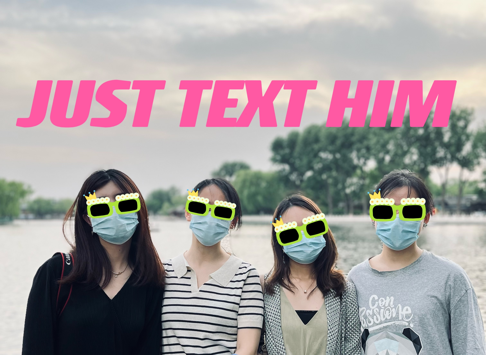
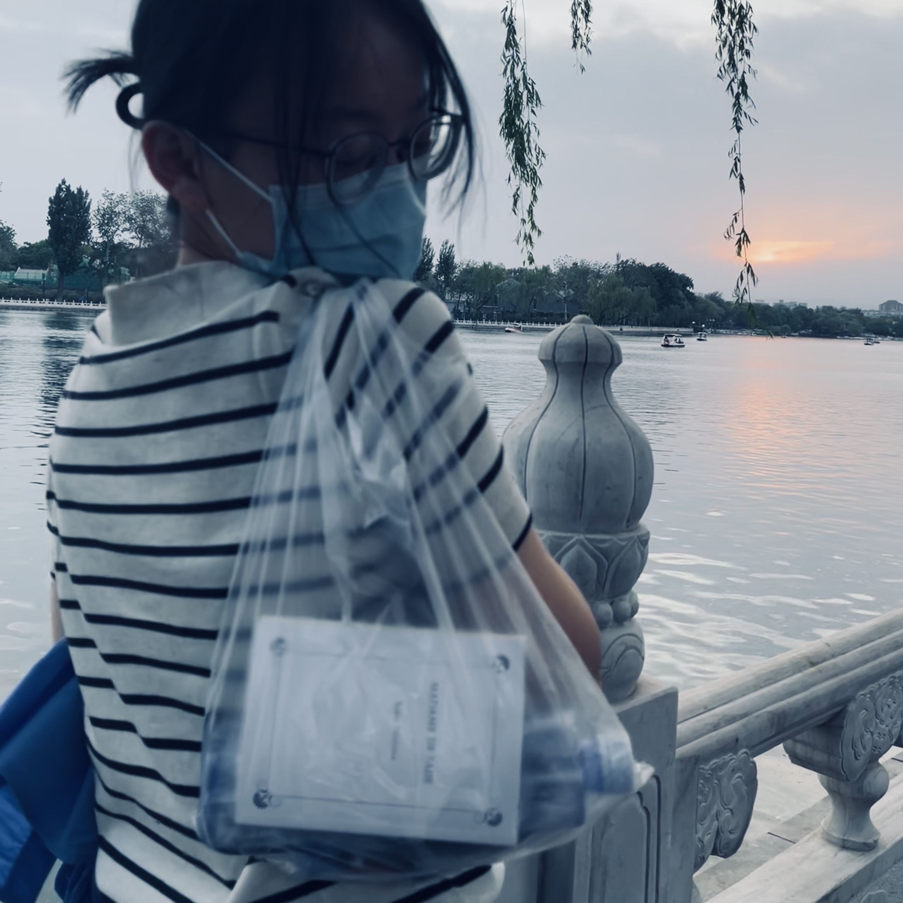

_我、Betty、阿K、小万决定在五一假期的最后一日去什刹海看日落。_

_北京疫情还是很严重的，从2号开始即禁止堂食，进出公共场所都需48小时核酸。为求自保，我们特意选了室外露天场所，不聚集，空气流通。_

_各自带了食物，也各自带了绿色的健康宝和48小时核算报告，哦，还有口罩——这两年出门的通行装备。_<!--more-->

> “
>  
> 茫茫人生,
>   
> 好像荒野。
> 
——黄伟文《单车》

## 戴口罩的帅哥

我们在什刹海地铁站碰头，地铁站旁边就是什刹海区域的入口。

六点二十，天还很亮，太阳刚要落下。阳光洒在湖边高大的垂柳上、洒在水面上，泛着不可思议的乐观蓬勃的、橙黄色的光亮。

我们开始沿着湖边走路。

Betty提议，趁着光线好，赶紧合照一张。Betty是个强势的、爱拍照的女人。她在神秘单位工作，总是搞些和钱有关的大项目。实际上，她超喜欢看小说，一心想成为小说家。其实说起来，我们出来玩的四个女人，都想搞搞创作。

接到Betty的指令，我就自动变成了执行的工具人，命令的威力就是这样。

我心想，需要快速找到路人帮忙合照。

找路人拍照可不是一件容易的事情。难点在于，要找到一个看起来就很会拍照的人，换言之，要找一个看起来年轻、时尚的人，这样的人可能会对拍照比较懂。

几分钟过去，一茬又一茬人从我们面前走过，我都没有找到心仪人选。

有些懊恼之际，一个帅哥出现了：身形健美，穿着深灰色T恤，黑色短裤，寸头，皮肤呈现健康的麦色。虽然戴着口罩，但是一定是个帅哥了。

与帅哥搭讪这种事情，我向来是不忌惮抓住机会的。当然，这件事也不容易，核心是要放弃自己的性格和尊严，让自己出现冒名者综合征——假装自己是个外向的社牛。更何况，我今天刷了眼睫毛，还喷了爱马仕大地。

说上就上。

「Hello，你好，请问可以帮我们拍张合照吗？」我戴着口罩，把眼睛弯成笑眼，身体前倾，递出手机，假装温柔地问到。

他几乎没有迟疑，接过我的手机，就开始帮我们拍照。

我果然选的不错，他横着、竖着帮我们拍了好几张，还指挥我们换了几个动作。

 

一张二创的合照

 

拍完，把手机还给我，他就向前走去了。他对今天的夕阳似乎也十分满意，一直看着夕阳的方向。

我看了他帮我们拍的照片，注意到，他自作主张帮我们全部用人像模式拍了，而不是一般人会直接用的live动图模式。这么看起来，应该是个有点意识的会拍照的男生了。

我们四个拍完继续往前走。五月的晚风吹过我们之间的几分钟的沉默。

我想大家应该都在想这个帅哥的事情。

我首先打破沉默：「我觉得刚才那个帮我们拍照的男生还蛮帅的哎！」

「是的，我也觉得，感觉是从健身房刚出来的那样，有点汗淋淋的，健康的帅~」阿K首先肯定了我的想法，她刚回国，不久后，又要出国读博，做东南亚研究。

「他的小腿线条好好看」Betty接住话茬，称赞道。

「男生只要干干净净，身材管理好，就很可以了。」小万感慨。小万在神秘单位工作，每天要写很多文章。只要出门，都会带一本小小的书，文学或者哲学的，可以直接放在口袋里的那种，我都不知道她从哪里买到这些小书的。

 

带着英文小书的小万

 

戴口罩的帅哥走的蛮快，一会就在我们的视野里消失不见了。但我敢肯定，我们四个都想再遇见他。

## 不在场的爱情

我们几个是这样的，常常将男人客体化。

仿佛对面的异性是一个文本、一个课题，可以被不断地分析、解构和理解。

我们多少都有点恋爱的经验。但至于，我们为什么要谈恋爱这件事，我有时候会怀疑：

或许我们不是想要爱情本身，而是想要通过进入爱情理解爱情，为我们的创作事业不断充实素材。

就像我们今日出门，是为了在于亲身性地体验独特的社会情境下出门的感觉。进入现场，才能真的理解现场。

咦，有点把神圣的爱情工具化了，要不得。

太阳渐渐落下，天渐渐暗了，粉丝色的晚霞渐渐出现。

我们继续吹着风，走路。

很自然地，开始聊各自的爱情经历。

我们聊爱情，有一种范式。先需要一个我们在爱情的观点，用敏感的生活细节支撑，再佐以心理学、哲学、社会学的某些理论，最后抛出自己的疑问引发姐妹们的讨论。

我们在爱情里的困惑常常与我们选择的对象本身特点相关。

我们的对象有一个共性，没有一个是和我们一样喜欢搞点文艺的东西的。

大部分情况下，他们是无法共情，我们过于丰富和敏感的精神世界的。如果和他们一起看电影，像是《牯岭街少年杀人事件》这种，是不可以的，对方可能会睡着；像是《甜蜜蜜》这种是可以的，通俗易懂的故事，紧凑的情节，对方看得下去。

但是我们的对象似乎也都对于爱情有自己的理解和追求————就是普通的那样的爱情咯。陪伴、生活、支撑、温柔地爱着对方。

其实我心里有时候会想，或许这才是文艺女青年需要的恰如其分的爱情呢。

## 酒吧和咖啡馆

太阳完全落下了，晚风更有凉意。天色倒也没有完全黑下去。橙色的路灯每个都亮起来，抬头望天空，是暗蓝暗蓝的。

我们环湖行走大半了。

一般来说，什刹海附近总是极其热闹的，酒肆商家众多，总是人山人海。当然，今时不同往日，疫情下格外冷清了。虽然都开着门，但是游人无法堂食，只能买了食物就走。

「哇，这真是我看到的最像火锅店的酒吧！」小万高声惊叹。

我们顺着她的眼神望过去，她是在看着「银海轩酒吧」这家店。说真的，这亮堂堂的红木黄灯的装饰，确实像火锅店，不像酒吧。

「你要是想吃火锅，我们也可以的！」银海轩门口坐着的几个店员，也朝我们大声互动起来。他们应该是在门口卖酒。

笑死。

人与人之间的互动还是很有意思，比吃火锅还有意思。

走了两个小时，我们决定找个地方休息一下。

随便走走，碰到了一家萤火虫咖啡馆。门口有可以坐下来的台阶。我们决定买个喝的，坐下来吃点各自带的零食，休息一下。本来想问店主要几个小凳子，店主很不好意思，说政策不让提供桌椅，她给了我们几个垫子。

 

沉迷聊天的人类

 

我带了薯片和好丽友，阿K带了鹰嘴豆，Betty带了美珍香肉干。小万只带了一本小书，没带吃的。

边吃零食，又开始聊天。

从阿K的研究方向东南亚开始聊起，聊民族主义，聊马华文学，聊黎紫书的新作《流俗地》，聊作为小说家的谋篇布局的技巧，聊各自写作的体验，聊未来的可能性......

聊到萤火虫咖啡馆关门关灯，外面一片漆黑，我们才停下。

很不错的聊天体验。原来只需要朋友，只需要一席之地，只需要把表达交给互动的语流。

我们起身往回走。

夜色更深了，寒意也更重了。

神奇的是，水面上，还有人在划船。是一对情侣。我看不清他们的脸，但似乎能感受到他们在清冷的水面上的温暖的情谊。

惶惶的时局里，他们是在场的爱情。

走到入口处，我们四个各自回家了，怀着各自的心事。

想起明日就是立夏了，今夜是今年春天的最后一个夜晚。不知怎么地，总是回想起郁达夫写的《春风沉醉的夜晚》，它的结尾写道：

> “云层破处也能看得出一点两点星来，
> 
>但星的近处，黝黝看得出来的天色，
> 
>好像有无限的哀愁蕴藏着的样子。”

是今晚了，我想。