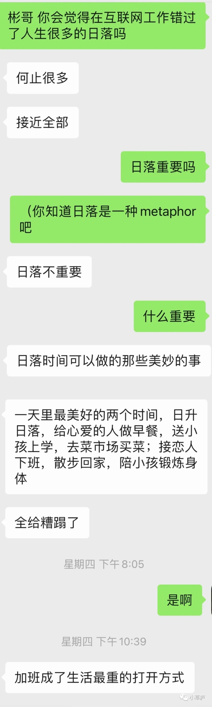

_生存大于生活。_ <!--more-->

刚才在等红灯过马路，一个蓝色的气球突然落到了马路中间。路上的汽车并不知道这个蓝色气球，依然往来行驶。

我心里有点紧张：汽车会压到这个气球吗？这个气球会爆炸吗？

没细想，一辆汽车疾驰而过，一声响亮的「嘭」，蓝色的气球爆炸了。

绿灯亮起，我走过这个爆炸的气球残骸，我打算去奥森看夕阳的。

但是今天并没有夕阳，因为今天是个阴天。

但是我没有改变计划，仍然来了奥森。这是北京的市区里难得的有宽阔的水面的地方。

我喜欢宽阔的水面，在水边心会变得宽阔。

现在我正坐在奥森宽阔的水边的阶梯上打字。身边有拍婚纱照的情侣，有拍毕业照的学生，有很多孩子在喂金鱼，也有像我一样在发呆的年轻人。我和这些陌生人共同拥有着此刻的宽阔的水面。

其实，我今天必须来到水边，我的心需要变得宽阔。

从昨晚到现在我都处在一个迷茫的状态里。

一个北大的师兄，也是之前的同事，28岁，胃癌晚期。他高高瘦瘦的，很聪明，很帅。

昨天下班走路回家的时候，随手刷朋友圈。看到了他写的文章，记录从确诊、手术、化疗、康复，复发的整个过程。

我整个人立刻处于巨大的震惊和揪心的情绪中。年初做手术的时候在病房的伤痛记忆也一下子被唤醒。住过院的朋友应该都深有体会吧——那些灰色的、无助的、需要每分每秒的忍耐的日子。

如果说有什么经历真实地对我的人生观产生了巨大的影响，这一次的住院手术经历就是这样的契机。

所以当我看到师兄的文章后，我陷入了深深的共情。这该是一种多么痛苦的、无望的心情。

能活着就意味还能有明天，还有可能性，还有希望。生存是大于生活的。活着，就是一切。

以及，我非常非常明确地认识到了，人生可以拥有的夕阳和水面是有限的。

前几天和互联网的前辈聊天，他在互联网工作了很多年，勤勉认真也小有成就。

 

聊天对话

 

我当然知道，我们之前的选择决定了我们现在的错过。

只不过我在想，

做喜欢的工作，和不错过人生的每一个夕阳 必然是冲突的吗？

如果意识到了自己的错过，是不是可以选择停止这样的错过呢？

是不是可以到了某一个时点，选择停止下来，真正过一种不后悔的不错过的生活呢？

又是不是或许这一切根本没有答案，人生是不是不存在一切都和解的瞬间？

我不知道。

我还坐在奥森的水边，天已经完全黑了，水面还在我的眼前，静静地流淌，和时间一起。