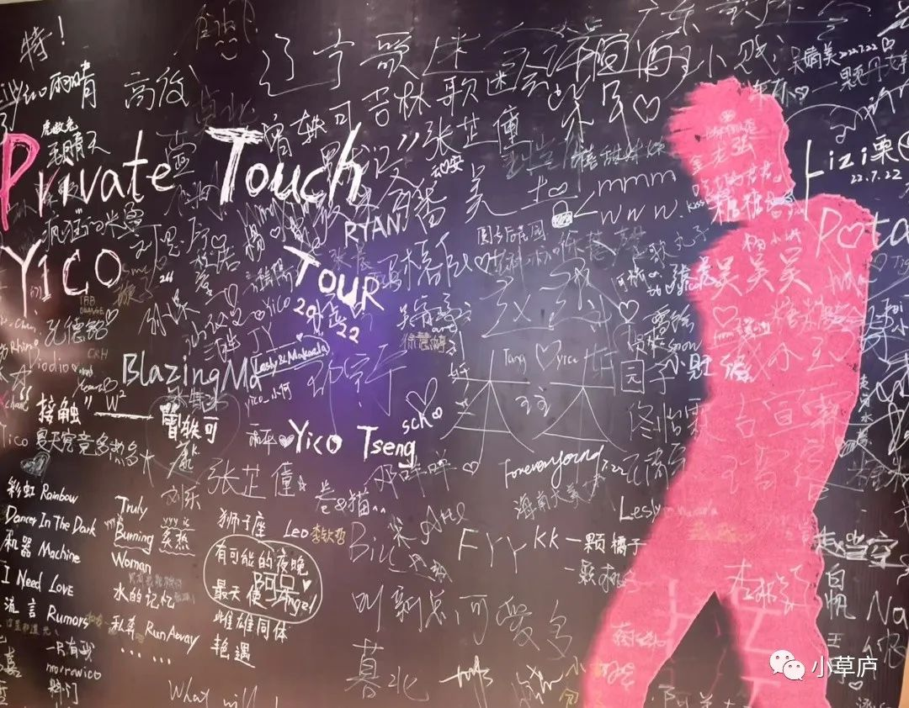
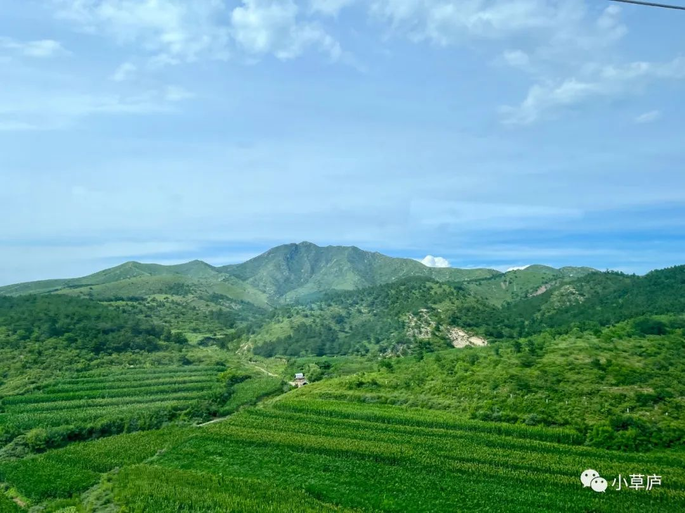
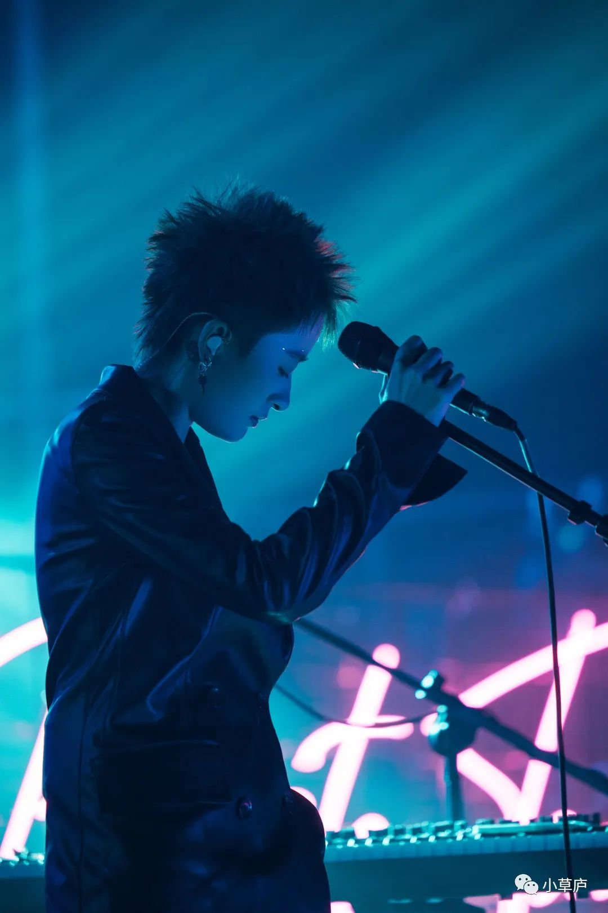
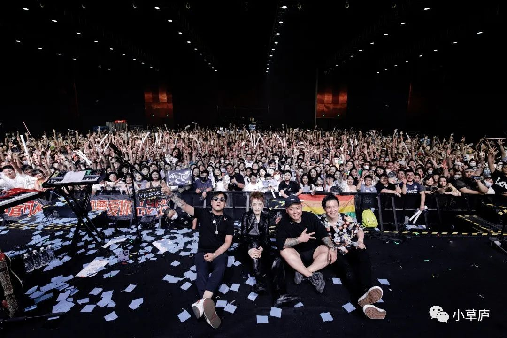

_她没有浪费自己的天分。_

_她好像做着自己喜欢、擅长的事情，做得很好，也好像生活的很好。_ <!--more-->

>“
>
>距离难免让人胆怯，
>
>怕分界更怕越界，
>
>可距离不就是用来让人跨越，
>
>你走一步 我跟一注，
>
>靠近再靠近我炙热的心。
> 
——曾轶可《北京到台北》

### 1

我是周五下午7点到沈阳的原料库Live House现场的。

负一层的大厅里立着一块大大的签名板，每个人都可以在上面写字。我刚站定准备观摩，一个扎着丸子头、穿着吊带和牛仔短裙、高高瘦瘦的女生，走上前来，边喝着奶茶，边在板上写：

「**被你伤害后，
竟留下幸福感觉。**」

落款是她的名字。

写完，她高高兴兴地牵着自己的男友走进内场。

我会心一笑——这是曾轶可《三的颜色》的结尾句。曾经反反复复看着这首歌的歌词，感叹于曾的哲思、灵气，以及我想她一定谈了很多次很充沛的恋爱。

不过眼前这女生看起来无比幸福地在签名板上写下这句歌词，倒让我有了许多怀疑其幸福的表象的空间。

 

签名版

 

### 2

7个小时前，我还在北京的厂子里搞我的产品需求。我的内部通讯工具上，已经显示了我「请假」的状态。

但是一大早还是挺忙。说真的，我的工作没我不行——只要流水线的一环停止工作，整个流水线就会开始报错。

但我还是决定周五请半天假，坐三小时的高铁，在晚上的八点，听到曾轶可的演唱会。

2020年以来的一切，就像她早年的一首歌名：

「**我们不是只有现在吗？**」

其实，在北京前往沈阳的高铁上，我已经感到足够满足：

列车穿梭于黑色山洞穴与广阔青山间，在映照着蓝色的天空和白色云朵的水面上留下倒影，偶尔也经过大片大片绿色的水稻田与玉米地。

心里很宽阔，很自在，深深赞叹这片土地的大好河山。

 

旅途的窗外

 

### 3

周四晚上的时候，通知了下我妈，要去沈阳看演唱会。

我妈问我：「你追星啊？」

我觉得这问题很难回答。类似的问题也被问过：「你是她铁粉吗？」

我自觉，我可以用某人的粉丝来定义我自己，并将自己划分至某一个标签下，并用许多我喜爱她的例子来佐证我确实是她的粉丝。

但是我的内心非常诚实，并没有这一套叙事。我只是单纯地喜欢她的一些创作，和她的状态。

说起来，小时候，湖南电视台的每一年的选秀我都会看。曾轶可09年出道，当时我13岁。《最天使》《狮子座》《你是我最好的朋友》《复习小情歌》舞台，我的记忆还很深刻。

特别是《复习小情歌》的歌词那一句「这是一首简单的小情歌，唱着我们心头的白鸽，飞走的忐忑」，改得真好啊！

后来的很多年里，我不断长大，她也写了越来越多歌，我没有主动follow她的所有状态，只是不断听到她越来越多优秀的歌。

从《最天使》《狮子座》《夜车》，到《星星月亮》《北京到台北》《诗人的眼泪》，到《私奔》《三的颜色》，到《彩虹》《Burning》......

如果从现在的角度回看，这十几年的时间，她没有停止过对生活敏锐的感受、没有停止过创作与表达、没有吝啬于将自己的脆弱凝练成诗一般的词。

她没有大火，因而也有许多自由，有时间不断在世界各地游学、玩耍，（也应该谈了很多很多恋爱）。某种程度上，我步入了越来越驯化的体系的同时，她却好像还是那么纯粹、敏感和自在。

她没有浪费自己的天分，她好像做着自己喜欢、擅长的事情，做得很好，也好像生活的很好。

 

现场演出照

 

### 4

演唱会的现场很热，但气氛很好。

《辣糖》开场，「别人说什么就是什么吗？为什么不自己尝一下。」

第二首是《彩虹》，「拥抱是禁忌，拥抱是羞耻，可是对我来说，拥抱是命运。」

现场人群传递的泡泡机使得空间里有许多浪漫的泡泡、有伴随歌曲高潮洒向天空的纸片、有许多炫目的五彩的灯光，还有许多歌声——她的，我的，我们的......

现场真是极富有魅力。

演唱会的歌以她的新歌为主，结尾安可曲目是《三的颜色》《狮子座》《最天使》和《有可能的夜晚》。

全场大合唱《狮子座》和《最天使》的时候，我意识到这两首歌在如今，已经不是两首简单的小情歌了，而是她青春的纯净情丝、年少成名的懵懂反复吟唱，与真正成为拥有许多作品的歌手的一切一切的开始。

我已经很久没有听这两首了，但是歌词就好像长在身体的某处的记忆里，跟随旋律自然地全部唤醒，每个字原来我都记得很清楚。

是吧，或许可能生活的每一个瞬间都不会被白白浪费或遗忘，或许这两首歌也让我意识到年少的自我仍然存在于我体内。

### 5

演唱会的现场有很多很多女生，男生不是那么多。

我的四周有一直紧紧拥抱在一起的女生，接吻的女生；有并肩站在一起的男生，牵手的男生；也有一起来的男生和女生，比如我旁边的男生一直在给女生拿着小电扇吹风，而女生在很快乐地跟着唱歌。

迷离闪烁的灯光打在每一个人的脸上，每一个人都看起来那么沉醉于此刻。

真好，至少此刻，大家看起来都那么幸福。

 

大合照

 
