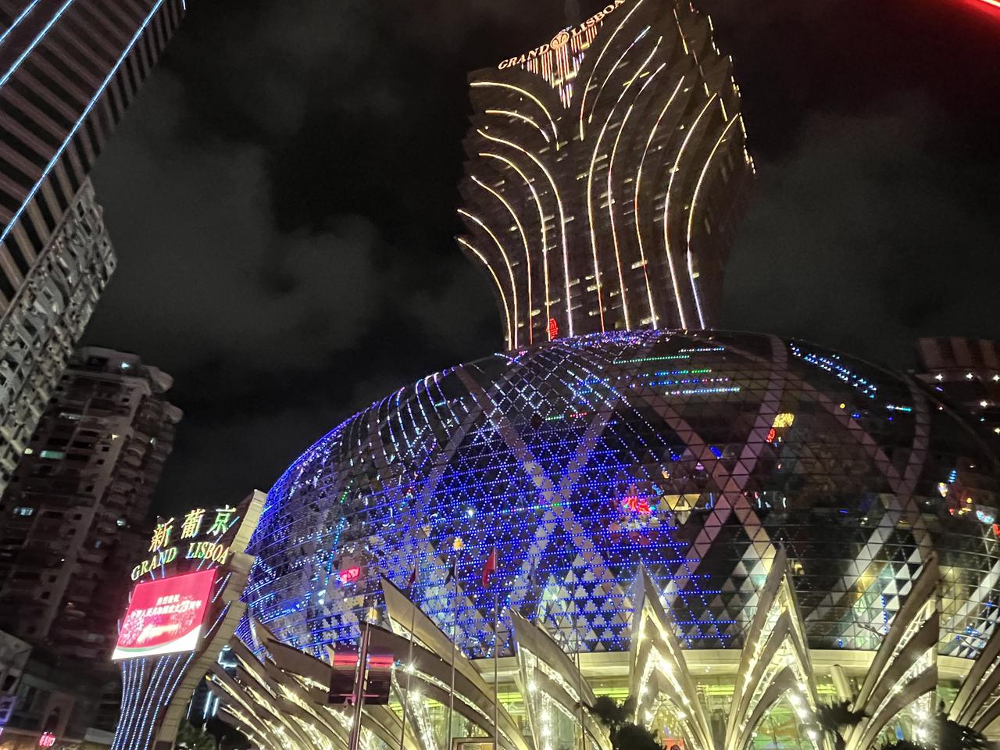
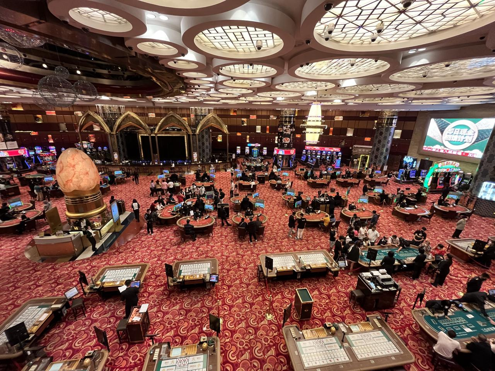

我十一假期去了澳门。

在澳门的几日，参观了众多知名赌场：新葡京赌场、老葡京赌场、金沙赌场、威尼斯人赌场、财神爷赌场、星际酒店赌场、美高梅赌场.....<!--more-->

其实用参观也不太合适，因为赌场在澳门无处不在，特别是大型酒店的必设赌场、街头巷尾也有大大小小的赌场。不用特意参观，随意穿梭，赌场便触手可得。

当然，我是未花费一分钱的，真真是万花丛中过，片叶不沾身。主要的原因是我不会，赌场的onboarding做得都挺一般，新手无人带路，每个人都好像早就知道规则一样地在赌博。

这些赌场几乎没有任何差异化，平民区的老虎机、百家乐、二十一点......也都设有高额博彩区供更有钱的人来参与。或许澳门博彩的意义正在于，标准化的赌场成为城市的别样水电煤，凡是生出一点想赌一把的念头，都可以在这座城市触手可及。

每个赌场都将密密麻麻的牌桌放置在金碧辉煌的大堂里，穿着制服的荷官镇定自若地发牌收注，坐在牌桌前的人们或冥思、或激动、或叹息。我穿梭于其中，有种感觉，现场好像是在银行办业务，但办的是送钱的业务。

真是奇特。

 

新葡京赌场

 

 

赌场内景

 

澳门这城市本身就建立在奇特的繁荣与欲望之中。

大街小巷的赌场、购物中心、游客打卡拍照小巷，仿佛城市仅仅依靠花钱而存活。而且对比澳门商铺对于支付宝和微信的普及度，与国际信用卡的普及度，很容易发现其对内地游客的支持度是远超于国际游客的。

因疫情而萧条之际，我们只花了每晚500元，就可以住到威尼斯人酒店。酒店大的可怕，光是在里面走路就可以把人累坏。在酒店的过道穿梭时，可以看到天蓝色的墙壁、墙上的欧式画作、闪闪发亮的射灯。

在澳门，经常可以发出感叹——有钱真好，这里抹平了一切生活的皱褶。

其实，我也不小心发现过资本主义的马脚——偶然打开一个货梯的门，里面也同样是肮脏的水泥路面，散发着垃圾气味的墙体和破损斑驳的墙面。

在新濠影汇（City of Dreams）的入口，我不小心踩到了门口地面刚补的一小块水泥，鞋底沾上了水泥，路面留下了我的脚印，我粘满水泥的鞋子踏进了新濠影汇的堂皇的瓷砖地面。

但踏入巨型的商场大楼后，又会强烈地被眼前所有一切的繁荣震撼——露出的马脚只是一瞬间的，进入City of Dreams，一切都如梦似幻，犹在梦中。