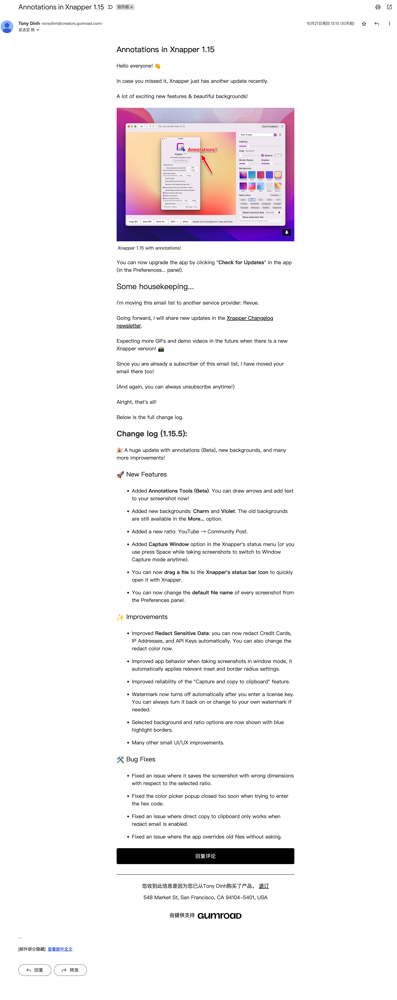

日常很喜欢体验一些新的产品，此处「产品」定义较为广泛，包括互联网应用，也包括消费品、各种活动等。而在互联网应用的范畴内，又尤其以一些小的团队产品开发者搞出来的新应用最为有趣，它们往往在场景上更细分和垂直，拥有极强的创新能力，对于产品的需求和场景的理解更加深刻。<!--more-->

其中，除却产品本身的体验外，另一个有趣体验的来源，是他们写的产品新功能上线说明。由于海外大都由邮箱注册，所以一些产品的开发者会直接以邮件的形式告诉注册的用户，产品有什么新功能。

例如，我最近在用的一个比较小众的截图软件Xnapper，它主打的特色是截图后有定制化的背景图，是一个Twitter上的程序员Tony Dinh自己开发的小产品。

他会定期给用户的邮箱发送产品更新的消息，很可爱，有很多小表情，对功能的讲解也很清楚。

 

Xnapper的功能更新邮件

 

还有例如最近在海外挺火的日历管理软件Cron，自从我1月份开始注册为新用户使用其demo后，他们产品的创始人Raphael Schaad就一直会给我发邮件告知产品的进展，非常亲切，开头都是Dear Lucca😁

 
.png)

Cron的功能更新邮件

 

作为一个普通的用户，一方面可以感受到许多来自产品创始人员的努力工作的成果、对产品的诚意和对创造性工作的自豪，另一方面也会感受到与这个产品之间的连接度的加深。

而作为一个产品经理同学，在看到这些功能更新的邮件的时候，可以看到这些产品的创始人员对产品功能拓展的思考、对需求的思考和对产品的规划性的蓝图，还是非常有收获的。

当然，我也想到，这其实还是比较适合于一些组织结构较为简单，产研团队较为精干的产品。毕竟，产品复杂度越高、参与的产研同学越多，产品所承接的场景越多样，功能更新的详细updates也就越难做。而且对国内用户来说，使用邮箱这样的统一收口来注册产品的习惯几近于无（飞书是有的hh），也难以把新上的功能投放到每个人的收件箱。

不过，总的来说，还是感受到，做什么事情，都需要创意与诚意呀，看到的人会感受到这一切的。