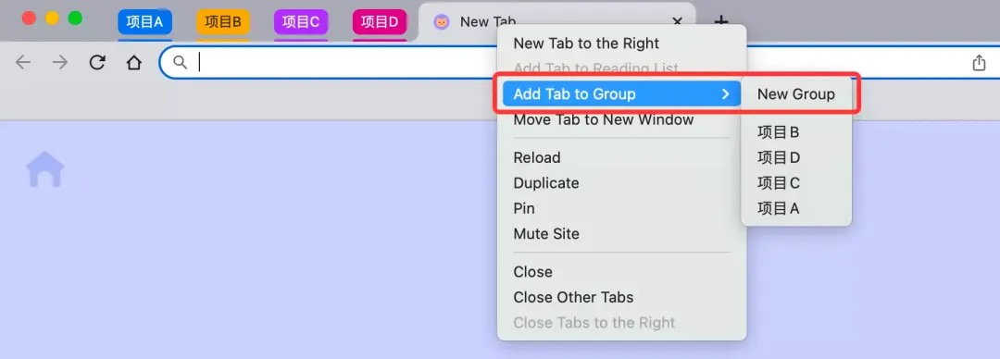
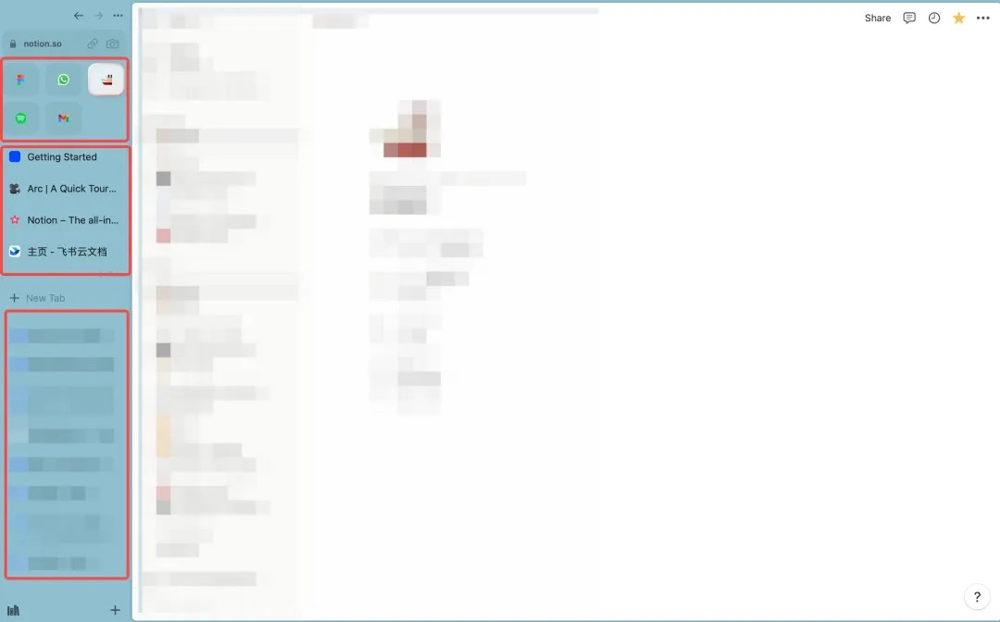
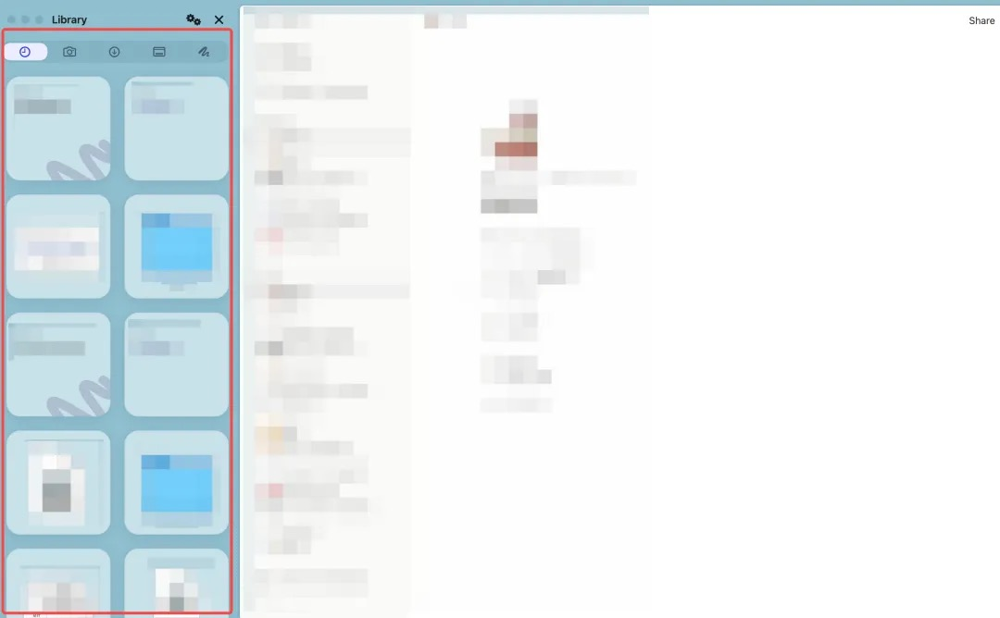

使用Arc浏览器整一个月了。目前它已经取代了Chrome浏览器，成为了我的主力工作用途浏览器。很喜欢这个产品，分享下我的想法和使用体验。<!--more-->

>“
>
>优秀作品的秘诀是：非常严格的品味，再加上实现这种品味的能力。
>
> 
——Paul Graham《黑客与画家》

### 1 What is the browser for? 获取内容与生产内容

从最朴素的概念看，浏览器是用来呈现网站（网页）的工具软件，例如Chrome、Safari、Edge、Firefox、360浏览器等。

根据2022年11月最新的数据统计，全球（综合桌面端+平板+手机端等）使用最多的浏览器是Chrome，占比61.36%，随后是Safari和Edge浏览器。

 

2022年11月全球浏览器市场份额

 

这些浏览器的产品结构都差不多，网站名称在浏览器上方横条依次排开，下方是网页的地址，中间通常有标签栏目可以添加书签等。在网上目前的浏览器测评中，主要聚焦的是浏览器的打开页面速度、占用设备内存等硬实力。

人们使用浏览器，大部分的情况是为了获取内容：搜索问题获得答案、打开网页浏览资讯、打开视频网站看视频。可能对一些对于互联网不太了解的用户，也会将浏览器等同于内容的搜索引擎。

对于海外的用户而言，以上使用浏览器的行为应该仍然广泛存在（调研了几个国外的朋友+个人的感觉。）

而对于国内的大部分用户来说，浏览器作为获取内容载体的可替代性越来越强。搜索获取内容的入口，如今可能更多是抖音、小红书、微信搜一搜，以及其他更多垂直的内容平台。（我个人感觉用百度搜到匹配内容的概率越来越低。）

歪个楼，最近大火的Dialogue AI ChatGPT，可能预示着未来的搜索使用场景可能会有更大的变化。

除了获取内容外，另一大浏览器的用途，是生产内容。此前，在浏览器上直接打开网页进行一些协同编辑工作的话，会经常遇到性能、卡顿的问题，所以大家更习惯下载本地化的应用。但是，随着网页技术的不断发展，目前基于web端开发的很多产品几乎已经完全没有卡顿的问题。

这里举几个我最常用的Web端产品：飞书文档和Figma。用过飞书的同学，都知道，在飞书的本地客户端打开一个飞书文档，都是直接跳转至到浏览器中，所有的编辑和保存都在浏览器中实时完成。

其实我也蛮好奇，为什么当时飞书文档一开始就是定位成网页端的产品。我自己感觉可能是：

1. 飞书是以消息为主的通讯工具，在电脑端操作时，如果把文档也集成在内部的话，整个产品太过复杂臃肿；

2. 在PC端操作时，直接跳转到web打开还是很方便的；但是移动端飞书文档就把飞书文档放在了应用内部，因为在移动端跳转到浏览器打开一个网页并不方便；

3. 在线文档的分享方式本身即以链接分享为主，天然适配于web端。

> Figma是一个作图工具，产品经理和UX设计同学经常使用。它和此前本地化应用Sketch、Axure的模式很不一样。阮一峰曾在其blog文档里分析：
> 
> Sketch 是一个原生 MacOS 应用，只能在苹果电脑上安装运行，没有免费版。Figma 则是一个 Web 应用，只要有浏览器就能用，而且有免费版。 
> 
> 你想想看，一个要用 Mac 电脑下载安装，付费才能用，另一个只要打开浏览器就能用，谁占优势不言而喻。
> 
> 但是，事情没这么简单。原生应用则可以调用底层的系统 API，网页应用受限于浏览器，很多功能实现不了。所以，Sketch 功能和性能肯定强于 Figma。
> 
> Figma 怎么解决这个问题呢？答案就是 Rust 语言。虽然 Figma 是网页应用，但它不是用 JavaScript 写的，而是用 Rust 写的，再编译成浏览器能理解的 WebAssembly 字节码格式，从而达到接近原生应用的性能。
> 
> 
——阮一峰《Figma为什么赢了Sketch》

我不太懂技术的详细能力，反正大概就是Figma用一套新的编程语言体系，使得Figma在web端的使用体验达到了接近原生应用的性能==

在更加云化的时代，web应用的技术突破给许多产品带来了更多的商业可能性，也让互联网时代的知识工作者们在进行内容的生产时的场域发生了变化——浏览器也逐渐成为了一个内容生产场所。

而Arc浏览器的出现，是对于浏览器用途发生变化后，所做出的一次非常有趣的产品力的革新。

### 2 Arc浏览器的产品力创新

**（1）产品结构的变化，原生应用的使用感觉**

Arc和其他浏览器在产品的结构上最显著的变化是所有的标签页都放在了界面的左侧侧边栏（可以收起），而不是界面的上方。在使用时，打开的网页可以完整地呈现所有元素，没有以往tab网址、标签栏的干扰。

这种设计，使得我们能有近乎于原生应用的使用感——毕竟没有一个原生应用页面上方还有网址、收藏的网站这些干扰信息。特别是将左侧侧边栏收起后，整个页面的展示和本地的原生应用几乎一致。

我有想过，为什么我会喜欢原生应用的使用感觉？

原因可能是两方面：一方面，原生应用的性能和使用体验优于web端的理念在我的认知里还是比较根深蒂固的，所以当我在web上体验到原生应用的使用感觉的时候，我的大脑被欺骗到了lol；

另一方面，在web端进行知识的生产活动时，我非常喜欢无干扰、干净的页面，可以更专注于手头的工作，有一种审美的趣味在里面。

**（2）针对「标签过载」的一套组合拳**

Arc最主打的一个产品特色是，解决浏览器「标签过载」的问题。

这个问题，很多知识工作者应该都会普遍遇到，打开了很多标签页，然后lost in tabs。特别是像我这种每天都在飞书文档里工作的人来说，这个问题太突出了。因为飞书文档在PC端打开后，都是跳转至浏览器，所以每天在浏览器能打开几十个、上百个文档链接，其中有很多是重复打开的、打开了用完忘记关掉的。

我一直使用Chrome浏览器，之前为了解决这个问题，我是按照我的项目，使用Chrome的标签分组功能，把不同的网页放进不同的组里，这样找起来方便一些。但还是非常依靠我个人的分类习惯，一不小心整个浏览器的tab又会爆炸。

 

Chrome浏览器，分组管理网页

 

Arc浏览器为了解决「标签过载」的问题，设计了不少很棒的功能。

在左侧的侧边栏中，分为三个区域：「Favorites」「Pinned Tabs」和「Today Tabs」。

 

Arc浏览器主界面

 

「Favorites」区域一般用来固定一些常打开的应用，我把会经常使用的Gmail邮箱、Figma、Spotify、Notion和Whatsapp网页版都固定在这个区域。

「Pinned Tabs」可以把一些总是要看的引导网页、没有看完的网页文章都pin在这个区域。比如，我现在正在写这篇Arc的介绍文章，需要反复去看Arc的官网、Arc的功能介绍文章等，我就会把这些网页pin起来。

在我平时的工作中，我喜欢把飞书文档的主页pin在这个区域，这样当我要去搜索文档的时候，就可以直接打开网页版的飞书文档首页搜索，而不必切回飞书应用。

在「Today Tabs」中，显示的就是我今天打开的网页们。我可以点击「clear」一键清除所有今天打开的网页。

同时，Arc也有自动清除能力，凡是24小时内没有使用的网页，都会被自动在浏览器侧边栏中清除，归类到Archive中（入口还蛮深的，这样设计挺好，因为一般也用不着😛）

还有一个Little Arc的预览小功能，也非常实用。我觉得和飞书用户简直太适配了。

针对一些网页链接，Arc提供小窗口单独预览的功能，这个在实际的使用场景中，对我来说是这样的：

我的同事在飞书的聊天中给我发了一个飞书文档链接，我只需要简单看下内容，并不需要对其做深度阅读或编辑，打开看完之后我就可以关掉这个窗口。那对我来说，我并不需要将这个网页跳转至我的浏览器中，随开随关即可。这个功能对于减少浏览器中不必要出现的tabs大有帮助。

此外，针对cure tab overload还有一些其他的功能，我用得比较少，在此就不多说啦，大家可以看：https://start.arc.net/cure-tab-overload

**（3）其他提高生产力的一些小功能**

在使用Arc的时候，还有几个我特别常用的提高生产力的小功能。

**拖拽分屏**

不知道大家有没有需要两个网页分屏使用的场景。我经常需要对照着一个文档，写另一个文档。

之前用Chrome浏览器的时候，我得搞两个Chrome浏览器窗口，再对齐窗口，或者用分屏软件让两个窗口按某种比例对齐。（如果有分屏需求的朋友，可以试试Rectangle这个应用哈。）

但是现在用Arc的话，可以直接把侧面栏的网页拖拽到至主窗口，它会自动实现分屏能力，还可以自己调节分屏比例，简直就是说精神高潮了。

 

**内嵌本地化素材，拖拽即可上传**

另一个我特别喜欢的功能是，Arc在侧边栏的左下角有一个Library的功能，点击后可以自动读取本地的素材。

 

Arc浏览器的Library功能

 

这个功能的使用场景是，当我想要上传本地的图片时，我不必离开浏览器，去本地复制图片；不必在网页上点击上传本地图片，在弹出的本地文件浏览器中选择文件。我只需要打开Library，拖拽图片到网页中即可。

Arc还有一些其他的功能，比如在网页中做标记，在浏览器中直接做笔记、画图，修改应用自己调试的网页代码等等，我用的还比较少，朋友们也可以自行去体验。

总的来看，Arc在产品上的野心在于成为一个知识生产的办公空间，让用户可以deep focus less distract。

### 3 一些其他的思考

**（1）面向的市场**

在文章的第一部分，我将浏览器的使用行为分为了获取内容和生产内容两个维度。个人感觉，从获取内容的角度去看，目前市面上的浏览器，其实已经做得足够好。这部分用户也不会转换其使用的工具至Arc。

而对于要在浏览器中生产内容的用户来说，目前市面上的已有浏览器做的并不好，Arc浏览器解决了很多这部分用户的痛点。在这一块，Arc具有比较强的竞争优势。

**（2）面向的用户**

在《简约至上》这本书中，作者对「主流用户想要什么」有过这样的论述，一直让我印象深刻：

“主流用户最感兴趣的是立即把工作做完，专家则喜欢首先设定自己的偏好。"

Arc浏览器面对的知识工作者们，已经使用了多年的Chrome, Safari, 有多少用户会真的愿意将自己的工作习惯迁移至Arc。毕竟大部分人在意的是get work done，真的对工具本身在意/产生兴趣的人应该还是少数。所以，未来Arc浏览器是否会真的获得主流用户的认可吗？

**（3）商业化的前景**

Arc浏览器的创始团队非常的fancy，也从一开始就获得了很多风投的支持。但是在商业化的方面，感觉仍然处于相对模糊的阶段。（毕竟其他浏览器可是免费的。）

Acr的主创成员之一Darin Fisher在接受The Verge访谈的文章里，曾提到

「Fisher likes to compare a browser to an operating system, which matches with The Browser Company’s idea that Arc isn’t just a browser but rather an iOS-like system for the open web.」一个商业化的想象空间是，或许Arc未来会成为网页端应用的平台。

文章里还提到，Arc也在做很多针对Mobile端浏览器的开拓性工作，究竟会是什么样的产品，值得拭目以待呀！  

 

_参考资料_

[1] 2022年11月浏览器市场份额｜similarweb

[2] Figma为什么赢了Sketch｜阮一峰

[3] Why one web pioneer thinks it’s time to reinvent the browser｜The Verge

[4]  简约至上｜[英] Giles Colborne

[5] 弧光未照明路，新衣难解旧愁——评 Arc 浏览器｜少数派·PlatyHsu

[6] Arc官网