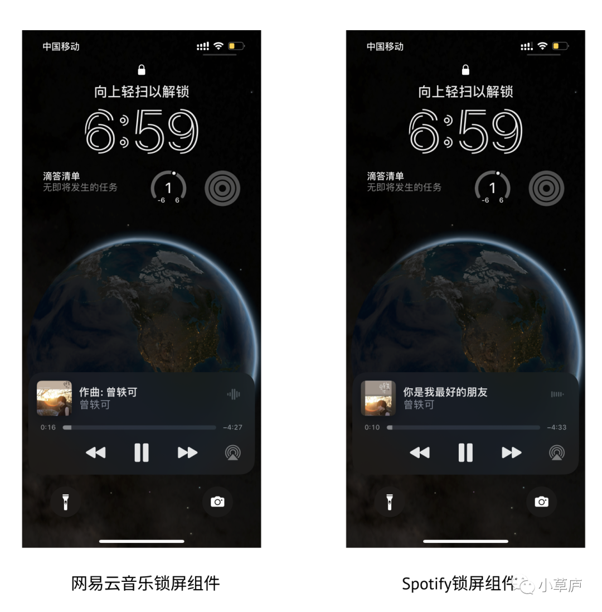

大家平时听歌用什么APP呢？<!--more-->

我目前是以「网易云音乐」和「Spotify」为主，网易云音乐在发现新歌和翻看歌曲评论的体验上更好，而Spotify曲库更全。
 
使用这两款不同的产品时，有一个产品的细节让我觉得很有意思。
 
大家应该都有锁屏后继续播放音乐的场景，比如通勤路上，工作摸鱼时（bushi）.....当听到不喜欢听的歌时，我们可能会直接拿出手机，点击锁屏上的切换歌曲标志，点击播放下一曲；或者，一首歌很好听时，我们在听到最后时，也会想要再听一遍。
 
网易云音乐的设计，包括QQ音乐与Spotify的设计组件元素是完全一致的：上半部分，右上方是歌曲的封面图，上方主体位置是歌曲信息，右侧有一个正在播放的动态元素；中间部分是进度条，可拖动时间轴；下半部分，是一个调节上一曲、暂行/播放、下一曲的标志，最右侧是蓝牙选择图标。
 

 
但是，在实际使用的过程中，针对「我想重听一遍正在听到的歌曲」这个场景，网易云音乐和Spotify给出的产品体验并不一致。
 
如果我在使用网易云音乐，我的操作可能是：点击「上一曲」、再点击「下一曲」切回正在听的这首歌；或者拖动进度条，把这首歌拉回初始位置。
 
而如果我在使用Spotify，我的操作是：点击「上一曲」，即可重听这首歌（如果我想切到上一首歌，需要连续点击两次「上一曲」；或者我也可以拖动进度条，把这首歌拉回初始位置。
 
除了锁屏组件的设计，在APP内部的点击「上一曲」，Spotify也是返回该首歌曲的初始位置，需要连续点击两下才可以切回上一首歌。而网易云音乐/QQ音乐则是切回上一首歌。
 
我觉得这个产品设计的差异很有意思。
 
网易云音乐/QQ音乐的产品设计，很符合我们对于上一首、下一首的按键的认知的直觉，但是在满足「重听这首正在听过的歌」这个需求上，并没有给出一个优美的解决方案。
 
而Spotify的产品设计，在刚开始使用的时候，需要一点点认知的成本——需要用户在操作中，认识到「上一曲」这个按键，单击是回到歌曲开头，点两下才是切到上一首；但是一旦用户习惯于这个操作之后，能很好地满足「重听这首正在听过的歌」这个需求。
 
但这里可能还有个不同用户的不同使用习惯的问题：大家是倾向于听到这首歌结尾的时候，重听这首歌；还是在听到下一首歌时，才会切上一首歌呢？
 
Spotify的产品设计实际上考虑了这两种场景。但如果是前者，那么Spotify的产品设计似乎肯定是更胜一筹；但是如果是后者，似乎网易云音乐/QQ音乐的产品设计便也已经足够🤔。
 
从我自己的使用体验来说，我还是蛮喜欢听到歌曲结尾或者听到副歌部分，想再听一遍，所以我个人更喜欢Spotify的设计。甚至在用过Spotify后，切歌的习惯都被塑造了，用回网易云音乐的时候倒经常出现不适应切歌的情况——所以才会写这个小文章😛==