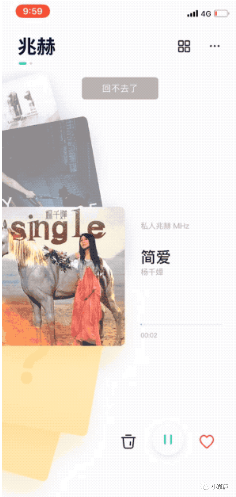

最近的产品工作，开始密集地要去写很多用户故事。大概就是，用简单的故事描述清楚用户的需求，和他们期待从产品中得到的价值。

通常的描述性语言是，作为一个用户，我在什么场景下希望做什么、得到什么，这个产品能力给了她什么。

关于这个话题，想记录下来一些想法。

<!--more-->

>“
>
>从瞬间到永恒，从方寸到寰宇，每一个人物的生命故事都提供了百科全书般的可能性。大师的标志就是仅仅从中挑选出几个瞬间，却能向我们展示其整个人生。
>
> 
——罗伯特·麦基《故事》

### 1 What is the browser for? 获取内容与生产内容

我意识到用户故事是怎么回事，是来自于我自己的一个小小需求。

我想要做的产品能力很简单，大概就是用户填写表单的时候，在进行人员选择时，给用户推荐她在该场景下，常用的人有哪些。从比较实际的产品实现能力来看，这是一个还蛮简单的事情，定一个人员推荐的策略就可以。

直到我看到了 Atlassioan 的一个网页。2020年，Atlassian的推出了机器学习的智能推荐策略，把智能推荐人员、个性化搜索推荐、智能识别聚合工单三大能力作为其智能推荐的关键场景。我所做的需求，正是他们需求的一部分。

而他们是这样来描述这个需求的价值的：

> 协作是关于在正确的时间拉入正确的人来完成项目或推动项目前进。虽然在一个10个人的小型创业公司时，这听起来可能不是一个很大的问题，但随着组织的增长，这种看似简单的体验可能会变得令人沮丧。找到正确的人变得更加困难，在页面中选择到对应的人所花费的时间可能会在一天中变得很多。
> 
Introducing machine learning-powered “smarts” to our cloud products

在具体的用户故事举例时，则是结合不同的角色面临的不同场景给出了许多非常生动、且直击痛点的例子。

> 选择某个项目的参与人员时，Jira 可以通过机器学习，推测到谁在处理类似的问题，预测最有可能5个备选者。
>
>在对知识库的页面进行人员的权限控制时，Confluence 可以根据用户和谁合作得比较多，以及不同人通常处理的工作，来预测用户可能希望页面查看限制的人员。
> 
Introducing machine learning-powered “smarts” to our cloud products

看完这篇类似于功能上新的 PR 文章后，我更加感性地感知到这个看似简单的产品功能，它的使用场景和价值到底是什么。这样的感性认识，其实通过一个简单的功能描述是很难让人感知到的。

### 2 两个精彩的用户故事

前一阵子，和一个前豆瓣的 PM 同学吃饭聊天，聊到我上一篇文章里写的关于切歌的产品设计的细节。他给我贡献了另一个精彩的关于另一种切歌功能的用户故事。

早年间玩豆瓣 FM 的朋友，应该都经历过那个简单的音乐播放器：只能一首一首往下播放，无法切歌，无法搜歌。如果你想回切上一首歌，豆瓣会给你一句提示：

「回不去了」。

 

豆瓣 FM 「回不去了」

 

关于这个用户故事，他是这样讲述的：

“试想，当你一个人在偌大的北京打工，刚分手，深夜回到自己的出租屋，眼睛里充满血丝，身体早已疲惫不堪。

此时你耳机里正在播放着豆瓣 FM 的歌，你想切回上一首温柔治愈的歌重听一遍，你下意识地拿出手机，打开豆瓣 FM 想要切回上一首。

此时豆瓣 FM 出现了「回不去了」的提示语，一切心情交织于此，你感受到了人生时间的流逝，也感受到了豆瓣 FM 和你之间的情感的共振。”

这样的功能设计其实和版权的费用有关，大概的意思就是如果用户无法自己切歌，找歌，这样的版权费用会降低很多，甚至不涉及到侵权。（这里面法律问题比较复杂，我也上网找了一些资料，可以看这个[知乎的回答](https://www.zhihu.com/question/19637458).

无法切歌的 FM 产品当然可以看作是贫穷的豆瓣不得已而为之的策略。但是这样的产品文案设计，却突然有了「四两拨千斤」之感，颇能化腐朽为神奇。

当然，我的产品朋友，也是一个非常厉害的故事讲述者。他所抽象出来的用户故事和场景，一下子就让我感受到了这个产品文案的厉害之处。可能这比他平实地告诉我，豆瓣无法切回上一曲，切的时候会提示你「回不去了」，这样的叙述生动和有效得多。

另一个用户故事，来自于我看的一本书《简约至上》：

“对于一个视频应用而言，你站在城市街头，忽然感觉一阵骚乱。詹妮弗·劳伦斯正在向你走来。你迅速从口袋里掏出手机，把它交给一位路人，请他帮忙拍了一段你和詹妮弗的视频。然后你把它分享到 Facebook。

如果你正在设计一个视频应用，这个故事会告诉你如下重要事项：

1. 应用必须能快速启动，而且即使从没用过它的人也可以拿起来就拍

2. 必须能方便地找到并编辑视频

3. 最后，拍这段视频的目的是分享出去

故事性的叙述和非故事性的叙述对比非常显著。故事用三言两语就可以把核心的体验描述出来，把大量的信息浓缩到寥寥数语中，效率极高。而且，故事很容易记住，很方便与人分享。

事实上，人人都喜欢故事，即使我们自己不讲，别人也会编出来（“如果我使用这个相机，我就……”），让你不由得跟着他们的叙述展开想象。”

### 3 实操中的问题

在产品的工作中，在研究某个问题的时候，我们需要把它转换成一种认识。故事是描述认识的一种好方式。与一大堆需求描述相比，故事更容易让读者明白什么重要和为什么重要。

但是，我产生出的疑惑是，使用用户故事，如何确保故事覆盖度的全面性？毕竟，故事大概率只能是一个切面，可能真实的情况是非常复杂的。

但是后来和几位朋友的讨论中，我意识到，这个问题可能并不存在，因为从用户故事的真实用处来看，它本身就是用来被更好地理解问题，且从它的形成过程来看，它本身就是产品的需求不断抽象出来的结果。

和即刻认识的好友@春溪讨论用户故事目的时，她的想法是：

“在用户故事的编写过程中，我们要明确它的目的。用户故事并不是目的本身，它服务于以下目的：

- 更好地描述用户的问题；

- 用户角色的带入；

- 辅助解决方案的设计，比如更好地表达核心体验；

- 进行沟通协作（这一点尤为重要，主要用来说服同事）。”

而在实操的过程中，用户故事更像是为了更有效和清晰地表达产品需求描述，而创作出来的产物，它是手段，而非目的本身。那么，其实去写用户故事，这件事本身，就带有了解释的意味。

所以写用户故事是针对需求本身不断抽象的一个过程。它不是一个随便捏造的故事，而是一个精心设计地融合了用户典型场景、痛点、需求的容器。

在更加实际的产品工作的日常里，用户故事所使用的真实路径是：

- 先有一些具体的用户故事，比如用户结合自己的使用场景反馈的痛点，这些故事能帮助产品经理看到问题。

- 通过这些用户故事，PM 通常会开始进行更深层次更本质的需求分析，同时伴随着用户故事的辅助描述，形成了被定义出来的产品需求。

- 从产品需求的撰写、设计、开发、上线的全流程中，用户故事会进一步被讨论、被构建、被扩充或缩减，臻于完善。

很喜欢春溪和我所说的：“用户的故事是用来帮助 PM 「看到问题」，而不是定义问题。它是问题世界里漏出来的一道光，而不是这个问题世界本身。

我们需要看到这个光背后更本质的东西，看到更本质的东西时，就在开始构建用户故事，这个故事的构建从这里开始，到功能上线，贯穿全程。”